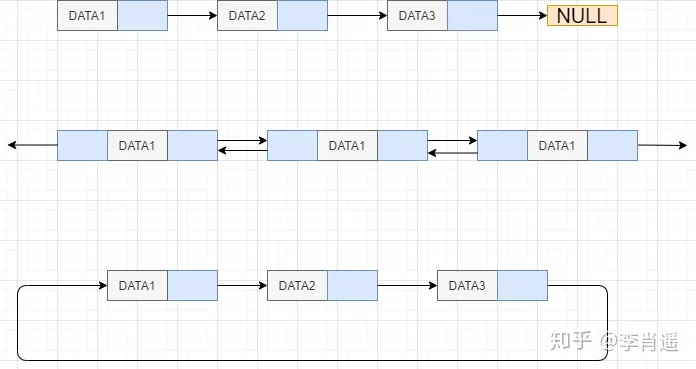

# 链表

## 定义

- 链表和数组一样都是线性的数据元素集合
- 它的数据存储上不是连续的，它的每个元素都指向下一个元素

## 分类

- 单向链表

  每个元素只知道下一个元素

- 双向链表

  每个元素知道上一个元素和下一个元素

- 循环链表

  通常的链表尾节点tail指向null，循环链表尾节点指向head

  

- 注：还有一只节点成为**哨兵节点**or**哑元节点**，它不存储数据，通常用作头尾，用来简化边界判断

## 性能

### 随机访问

根据index查找，时间发咋读O(n)

### 插入或删除

- 起始位置：O(1)
- 结束位置：如果一只tail尾节点是O(1),不知道tail尾节点是O(n)
- 中间位置：根据index+O(1)

## 单向链表

### 代码实现

```java
package singlylinkedlist;

/**
 * @author 10431
 * @version v1.0
 * @porject algorithm
 * @package singlylinkedlist
 * @company lpc
 * date 2023/7/27 19:27
 */


import java.util.Iterator;
import java.util.function.Consumer;

/**
 * 单向链表
 */
//Iterable<泛型> 泛型->将来需要遍历的值
public class SinglyLinkedList implements Iterable<Integer> {//整体
    private Node head = new Node(666,null);  //head指针


    /**
     * 节点类
     * 内部类：对外隐藏实现细节
     */
    //相对独立，和外部类的成员变量的没有关系，就可加static
    private static class Node {
        int value;  //值
        Node next;  //下一个节点指针

        public Node(int value, Node next) {
            this.value = value;
            this.next = next;
        }
    }

    /**
     * 向链表头添加节点
     * @param value
     */
    public void addFirst(int value) {
        //1.链表为空的情况
        //head = new Node(value, null);
        //2.链表非空的情况
        insert(0,value);
    }

    /**
     * 向链表尾部添加节点
     * @param value - 待添加值
     */
    public void addLast(int value) {
        Node last = findLast();
        last.next = new Node(value, null);
    }

    /**
     * 向索引位置插入
     * @param index - 索引
     *        value - 待插入值
     * @throw IllegalArgumentException - 找不到，抛出index非法异常
     */
    public void insert(int index,int value){
        Node prev = findNode(index - 1);
        if(prev == null){
            throw illegalIndex(index);
        }
        prev.next = new Node(value,prev.next);
    }


    /**
     * 返回最后一个节点
     * @return 返回最后一个节点
     */
    private Node findLast() {
        Node pointer;
        for (pointer = head; pointer.next != null;
             pointer = pointer.next) {

        }
        return pointer;
    }

    /**
     * 遍历链表while()
     * @param consumer
     */
    public void loop1(Consumer<Integer> consumer) {
        Node pointer = head.next;
        while (pointer != null) {
            consumer.accept(pointer.value);
            pointer = pointer.next;
        }
    }

    /**
     * 遍历链表for()
     * @param consumer
     */
    public void loop2(Consumer<Integer> consumer) {
        for (Node pointer = head.next; pointer != null;
             pointer = pointer.next) {
            consumer.accept(pointer.value);
        }
    }

    /**
     * 迭代器遍历iterable<>
     */
    @Override
    public Iterator<Integer> iterator() {
        //匿名内部类
        return new NodeIterator();
    }
    //某一个类，它使用了外部类的成员对象的时候就不能加static
    private class NodeIterator implements Iterator<Integer> {
        Node pointer = head.next;

        @Override
        public boolean hasNext() {//是否有下一个元素，是返回true，不是返回false
            return pointer != null;
        }

        @Override
        public Integer next() {//返回当前元素，并指向下一个元素
            int v = pointer.value;
            pointer = pointer.next;
            return v;
        }
    }


    /**
     * 根据index索引查找节点
     * @param index
     * @return pointer
     */
    private Node findNode(int index){
        int i = -1;
        for (Node pointer = head; pointer.next != null;
             pointer = pointer.next, i++) {
            if(i == index){
                return pointer;
            }
        }
        return null;
    }

    /**
     * 根据索引查找
     * @param index - 索引
     * @return 找到，返回该节点的值
     * @throw IllegalArgumentException - 找不到，抛出index非法异常
     */
    public int get(int index){
        Node node = findNode(index);
        if(node == null){
            //抛出异常IllegalArgumentException非法的参数异常
            throw illegalIndex(index);
        }
        return node.value;
    }


    /**
     * 抛出异常类
     * @param index
     * @return
     */
    private static IllegalArgumentException illegalIndex(int index) {
        return new IllegalArgumentException(
                String.format("index [%d] 不合法%n", index));
    }

    /**
     * 删除第一个节点
     */
    public void removeFirst(){
        remove(0);
    }

    /**
     * 根据index删除节点
     * @param index
     */
    public void remove(int index){
        Node prev = findNode(index - 1);
        if(prev == null) throw illegalIndex(index);
        Node removed = prev.next;
        if(removed == null) throw illegalIndex(index);
        prev.next = removed.next;


    }
}


```

### 单向链表笔记

 * static
    * 某一个类，它使用了外部类的成员对象的时候就不能加static
    * 相对独立，和外部类的成员变量的没有关系，就可加static
 * 链表遍历
    * implements iterable<泛型>迭代器
        * 泛型是需要输出的数据包装类型
        * hashNext方法——实现：是否有下一个元素，有返回true，没有则返回false
        * next方法——实现：获取当前值，并指向下一个元素
    * 遍历用for()循环
        * for()第一个部分只支持定义一个变量，第三个部分支持多个操作
    * Consumer<泛型> 函数式接口
        * 用consumer.accept(value);传值，由调用该方法的一方对数据进行操作
 * 抛出异常，非法的参数异常
    * throw new IllegalArgumentException

## 双向链表

### 代码实现

```java
package doublelinkedlist;

import java.util.Iterator;

/**
 * @author 10431
 * @version v1.0
 * @porject algorithm
 * @package doublelinkedlist
 * @company lpc
 * date 2023/7/28 19:21
 */
public class DoubleLinkedListSentinel implements Iterable<Integer>{

    static class Node{
        Node prev;//上一个节点指针
        int value;//值
        Node next;//下一个节点指针

        public Node(Node prev, int value, Node next) {
            this.prev = prev;
            this.value = value;
            this.next = next;
        }
    }

    private Node head;
    private Node tail;

    public DoubleLinkedListSentinel(){
        head = new Node(null,666,null);
        tail = new Node(null,888,null);

        head.next = tail;
        tail.prev = head;

    }
    private Node findNode(int index){
        int i = -1;
        for (Node p = head; p != tail; p = p.next, i++) {
            if (i == index){
                return p;
            }
        }
        return null;
    }


    public void insert(int index,int value){
        Node prev = findNode(index - 1);
        if(prev == null){
            throw  illegalIndex(index);
        }
        Node next = prev.next;
        Node inserted = new Node(prev,value,next);
        prev.next = inserted;
        next.prev = inserted;
    }

    public void addFirst(int value){
        insert(0,value);
    }

    public void addLast(int value){
        Node last = tail.prev;
        Node added = new Node(last, value, tail);
        last.next = added;
        tail.prev = added;
    }

    public void remove(int index){
        Node prev = findNode(index - 1);
        if(prev == null){
            throw  illegalIndex(index);
        }
        Node removed = prev.next;
        if(removed == tail){
            throw illegalIndex(index);
        }
        Node next = removed.next;

        prev.next = next;
        next.prev = prev;
    }

    public void removeFirst(){
        remove(0);
    }

    public void removeLast(){
        Node removed = tail.prev;
        if(removed == head){
            throw illegalIndex(0);
        }
        Node prev = removed.prev;
        prev.next = tail;
        tail.prev = prev;
    }

    /**
     * 抛出异常类
     * @param index
     * @return
     */
    private static IllegalArgumentException illegalIndex(int index) {
        return new IllegalArgumentException(
                String.format("index [%d] 不合法%n", index));
    }

    @Override
    public Iterator<Integer> iterator() {

        return new Iterator<Integer>() {
            Node pointer = head.next;
            @Override
            public boolean hasNext() {
                return pointer != tail;
            }

            @Override
            public Integer next() {
                int value = pointer.value;
                pointer = pointer.next;
                return value;
            }
        };
    }

}

```

### 双向链表笔记

- 有两个初始节点，一个是头节点，一个是尾节点
- 一个节点有三个属性
  - 指向上一个节点
  - 存储值
  - 指向下一个节点

## 环形链表

### 代码实现

```java
package doublelinkedlist;

import java.util.Iterator;

/**
 * @author 10431
 * @version v1.0
 * @porject algorithm
 * @package doublelinkedlist
 * @company lpc
 * date 2023/7/28 20:19
 */
public class CircularLinkedList implements Iterable<Integer> {

    private Node sentinel = new Node(null, -1, null);

    public CircularLinkedList() {
        sentinel.prev = sentinel;
        sentinel.next = sentinel;
    }

    /**
     * 抛出异常类
     *
     * @param index
     * @return
     */
    private static IllegalArgumentException illegalIndex(int index) {
        return new IllegalArgumentException(
                String.format("index [%d] 不合法%n", index));
    }

    private Node findNode(int index) {
        return null;
    }


    public void insert(int index, int value) {

    }

    public void addFirst(int value) {
        Node a = sentinel;
        Node b = sentinel.next;
        Node added = new Node(a, value, b);
        a.next = added;
        b.prev = added;
    }

    public void addLast(int value) {
        Node last = sentinel.prev;
        Node added = new Node(last, value, sentinel);
        last.next = added;
        sentinel.prev = added;
    }

    public void remove(int index) {

    }

    public void removeFirst() {
        Node removed = sentinel.next;
        if (removed == sentinel) {
            throw illegalIndex(0);
        }
        Node next = removed.next;
        sentinel.next = next;
        next.prev = sentinel;
    }

    public void removeLast() {
        Node removed = sentinel.prev;
        if (removed == sentinel) {
            throw illegalIndex(0);
        }
        Node prev = removed.prev;
        sentinel.prev = prev;
        prev.next = sentinel;

    }

    public void removeByValue(int value) {
        Node removed = findByValue(value);
        if(removed == null){
            throw new IllegalArgumentException("没有该值");
        }
        Node prev = removed.prev;
        Node next = removed.next;
        prev.next = next;
        next.prev = prev;
    }

    private Node findByValue(int value) {
        for (Node p = sentinel.next; p != sentinel; p = p.next) {
            if (p.value == value) {
                return p;
            }
        }
        return null;
    }

    @Override
    public Iterator<Integer> iterator() {
        return new Iterator<Integer>() {
            Node p = sentinel.next;

            @Override
            public boolean hasNext() {
                return p != sentinel;
            }

            @Override
            public Integer next() {
                int value = p.value;
                p = p.next;
                return value;
            }
        };
    }

    //静态内部类
    private static class Node {
        Node prev;
        int value;
        Node next;

        public Node(Node prev, int value, Node next) {
            this.prev = prev;
            this.value = value;
            this.next = next;
        }
    }

}
```

### 环形链表笔记

- 当链表中除了哨兵节点以外，没有其他节点时，sentinel.next就是sentinel、sentinel.prev就是sentinel
- 当链表中有其他节点时，sentinel.prev就是最后一个节点，最后一个节点的next就是sentinel节点

- #### 递归遍历

  ```java
   /**
     * 递归遍历
     * @param consumer
     */
      public void loop3(Consumer<Integer> consumer){
          recursion(head.next,consumer);
      }
  
      private void recursion(Node curr, Consumer<Integer> consumer){
          if(curr == null){
              return;
          }
          consumer.accept(curr.value);
          recursion(curr.next, consumer);
      }
  //测试输出
    list.loop3((value) -> {
           System.out.print(value + "\t");
      });
  ```

- #### consumer（函数式接口）用法

  1. 在需要使用consumer的方法参数列表中添加consumer< 1 > consumer

     1 - >需要处理的值的包装类型

  2. 在该类的内部使用consumer.accept( 2 ),如果需要将consumer作为参数传递给别的方法时，在调用的方法中也要咋参数列表中添加counsumer< 1 > consumer

     1 - >需要处理的值的包装类型

     2 - >需要处理的值

  3. 在测试方法中，调用方法并传入(（）- >{ 3 })参数

     3 - >对数据的操作代码

     
