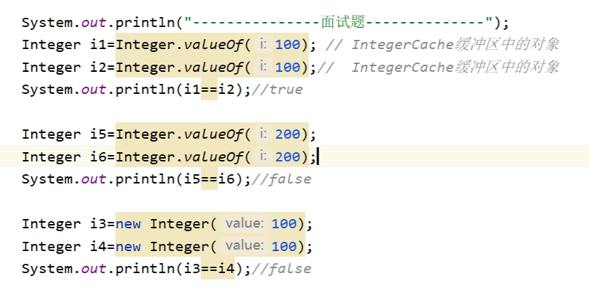
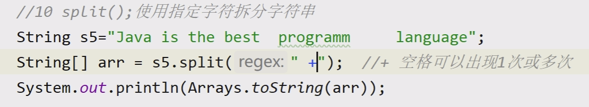
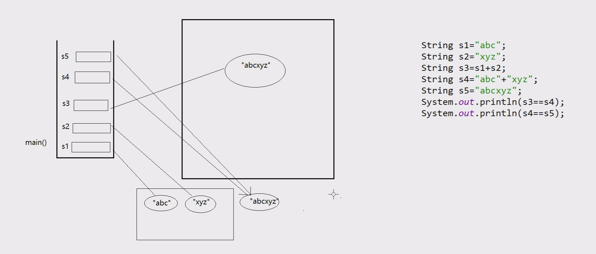
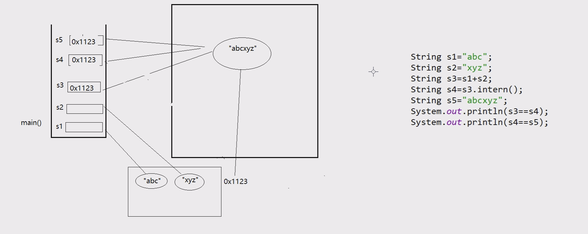

# day12

## 常用类

### 内部类

#### 概念

​	在一个类的内部再定义一个完整的类，内层的类称为内部类

#### 特点

- 编译之后可生成独立的字节码文件
- 内部类可以访问外部类的私有成员，而不破坏封装
- 可为外部类提供必要的功能

#### 分类

- ##### 成员内部类

  ​	在类的内部定义，与实例变量、实例方法同级别的类

  ​	外部类的一个实例部分，创建内部类对象时，必须依赖外部类对象

  ​	Outer out = new Outer();

  ​	Outer.Inner in = out.new Inner();

  特点：

  - 成员内部类可以使用任意访问修饰符。

  - 成员内部类可以直接访问外部类的属性和方法。

  - 成员内部类中属性和外部类的属性同名时，使用“外部类名.this”访问外部类的属性

  - 成员内部类不能包含静态成员，但是可以包含静态常量,JDK16之后可以包含静态成员

- ##### 静态内部类

  ​	不依赖外部类对象，可直接创建或通过类名访问，相当于外部类，为外部类提供功能 

  ​	不创建外部类对象，直接创建内部类对象

  ​	Outer.Inner inner = new Outer.Inner();

  ​	inner.show(); 

  特点：

  - 静态内部类可以使用任意访问修饰符

  - 静态内部类不能直接访问外部类的实例属性和方法，可以直接访问静态的属性和方法

  - 静态内部类可以包含静态成员

- ##### 局部内部类

  ​	定义在外部类方法中，创建对象范围仅限于当前方法，限制类的使用范围。

  特点: 

  - 不能使用任何访问修饰符。

  - 如果局部内部类所在方法是实例方法，可以直接访问外部类的实例属性和方法；如果局部内部类所在方法是静态方法，只能访问外部类的静态属性和方法。

  - 局部内部类可以访问局部变量，但是局部变量必须是final,JDK1.8 final可以省略,因为对象生命周期长于局部变量。

  - 局部内部类也不能声明静态成员, 可以使用静态常量，JDK16之后可以包含静态成员

- ##### 匿名内部类

  ​	相当于没有类名的局部内部类，必须继承父类或者实现接口。 

  ​	定义类、创建对象的语法合并，只能创建一个该类的对象。

  ​	优点：减少代码量。缺点：可读性较差。 

  特点:

  - 创建匿名内部类可以使用接口，抽象类，普通类，必须实现接口或抽象类中抽象方法。
  - 匿名内部类不能手动添加构造方法, 不能包含静态成员。
  - 匿名内部类中一般不包含特有的属性和方法，不能直接访问，可以通过可访问方法调用或匿名对象调用。
  - 匿名内部类生成的class文件名：外部类名$编号.class

### Object类

- #### getClass()方法

  - public final native Class<?> getClass(){}
  - 返回引用中存储的实际对象类型 【类对象】
  - 应用：通常用于判断两个引用中实际存储对象类型是否一致。

- #### hashCode()方法

  - public int hashCode(){}
  - 返回该对象的十进制的哈希（hash）码值（对象的地址）
  - 哈希算法根据对象的地址或字符串或数字计算出来的int类型的数值

- #### equals()方法

  - public boolean equals(Object obj){}
  - 默认实现为(this == obj)，比较两个对象地址是否相同
  - 可进行重写，比较两个对象的内容是否相同

  - ##### equals()方法重写步骤

    1. 判断obj是否为null
    2. 比较两个引用是否指向同一个对象
    3. 判断两个引用指向的实际对象类型是否一致（instanceof关键字判断）
    4. 向下转型
    5. 依次比较各个属性值是否相同

  - ##### equals()与 == 的区别

    - = = 如果是基本类型比较的是值，如果引用类型比较地址
    - 默认情况下Object的equals()方法和==相同，可以根据需求重写equals()方法

- #### toString()方法

  - public String toString(){}
  - 返回该对象的字符串表示形式（返回的是对象地址16进制字符串形式）
  - 输出对象时候，隐式调用toString()方法
  - 可以根据程序需求重写该方法，如：展示对象各个属性值

- #### finalize()方法（JDK1.9放弃）

  - 当对象被判定为垃圾对象时，由JVM自动调用此方法，用以标记垃圾对象，进入回收队列
  - 垃圾对象：没有有效引用指向此对象时，为垃圾对象
  - 垃圾回收： 由GC(Garbage Collector)销毁垃圾对象，释放数据存储空间
  - 自动回收机制：JVM的内存耗尽，一次性回收所有垃圾对象
  - 手动通知回收：使用System.gc(); 通知JVM执行垃圾回收

### 包装类

- #### 基本数据类型所对应的引用数据类型。

- #### 为什么需要包装类?

  - 基本类型功能比较弱。

  - Object可统一所有数据，包装类的默认值是null。

| **基本数据类型** | **包装类型** |
| ---------------- | ------------ |
| byte             | Byte         |
| short            | Short        |
| int              | Integer      |
| long             | Long         |
| float            | Float        |
| double           | Double       |
| boolean          | Boolean      |
| char             | Character    |

- #### 类型转换与装箱、拆箱

  - ##### 装箱和拆箱

    - 装箱：基本类型转成包装类型
    - 拆箱：包装类型转成基本类型

- #### 8种包装类提供不同类型间的转换方式：

  - Number父类中提供的6个共性方法

  - parseXXX()静态方法（除了Character）

  - valueOf()静态方法

- 注意：需保证类型兼容，否则抛出NumberFormatException异常。

- JDK 5.0之后，自动装箱、拆箱。基本数据类型和包装类自动转换。

- #### 整数缓存区

  -  Java预先创建了256个常用的整数包装类型对象

  - -128-127（.valueOf()）

  - Byte、Short、Integer、Long有缓冲区数组、Float和Double没有缓存区

  - 目的：提高效率，节省内存，实现对已创建的对象进行复用。

    

  - ##### 基本类型数据转换字符串

    Integer.toString(基本类型,进制)；

  - ##### 字符串转换基本类型数据

    Integer.parsenInt(字符串,进制);

  - ##### Character大小写字符转换

    - Character.toUpperCase(字符);

    - Character.toLowerCase(字符);

  - ##### Boolean操作

    - Boolean.toString();

    - Boolean.pareBoolean(“true”); true –> true,其他都是false

### String类

- Java程序中的所有字符串文本【例如“abc”】都是此类的实例。

- 常用两种创建方式：

  - String str1 = “Hello”;

  - String str2 = new String(“World”);

- 字符串字面值保存在常量池中。JDK1.7之前常量池存在方法区中，JDK1.7【包括1.7】之后移入堆中。

- 字符串具有不可变性，创建之后不可改变,指的是对字符串重新赋值的时候，会重新开辟空间，不会改变原来的数据

- 常用方法

  - public char charAt(int index)：根据下标获取字符

  - public boolean contains(String str)：判断当前字符串中是否包含str

  - public char[] toCharArray()：将字符串转换成数组

  - public int indexOf(String str)：查找str首次出现的下标，存在，则返回该下标；不存在，则返回-1

  - public int length()：返回字符串的长度

  - public String trim()：去掉字符串前后的空格

  - public String toUpperCase()：将小写转成大写

  - public boolean startsWith(String str)：判断字符串是否以str开头

  - public boolean endsWith(String str)：判断字符串是否以str结尾

  - public String replace(char oldChar,char newChar)：将旧字符串替换成新字符                                  

  - public String[] split(String str)：根据str做拆分  “ +”表示字符出现一次或多次

    

  - public String substring(int beginIndex,int endIndex)：在字符串中截取出一个子字符串

  - equals()判断字符串是否相等
  - s1.compareTo(s2)
    - 比较两个字符串的位置（ascll码的值）大小，s1减第s2，返回int，两个字符串相等为0
    - 如果一个字符串式另一个字符串的前缀，就比较长度
  - intern()方法，
    - 如果常量池中没有字符串，则把字符串复制一份，假如常量池，如果有，则不在加入，直接返回常量池地址
    - JDK1.7（常量池再方法区）之前把堆中的字符串的内容复制一份放入常量池
    - JDK1.7（常量池就在堆中）之后把堆中的字符串的地址复制一份放入常量池

### 可变字符串

- 概念：可在内存中创建可变的缓冲空间，存储频繁改变的字符串
- 优点：执行效率高于String
  - StringBuffer：JDK1.0提供，运行效率慢、线程安全。
  - StringBuilder：JDK5.0提供，运行效率快、线程不安全。
- 常用方法
  - append(String str) ：追加
  - insert(String str)：插入
  - replace(start,end,” ”)：替换
  - delete(start,end)：删除
  - reverse():反转内容

### 正则表达式

- 正则表达式就是一个验证字符串格式是否满足要求的字符串，使用一个字符串匹配一组字符串,这个字符串就是正则表达式。
- 正则表达式的用途
  - 匹配
  - 拆分
  - 获取
  - 替换

- #### 符号

  - ##### 元字符

  | **字符**        | **解释**                                      |
  | --------------- | --------------------------------------------- |
  | a               | 匹配字符a                                     |
  | [abc]           | 匹配  a或b或c                                 |
  | \[^abc]         | 任何字符，除了  a、b 或 c（否定）             |
  | [a-zA-Z]        | a 到  z 或 A 到 Z，两头的字母包括在内（范围） |
  | [a-d[m-p]]      | a 到  d 或 m 到 p：[a-dm-p]（并集）           |
  | [a-z&&[def]]    | d、e  或 f（交集）                            |
  | [a-z&&[  ^bc]]  | a 到  z，除了 b 和 c：[ad-z]（减去）          |
  | [a-z&&[  ^m-p]] | a 到  z，而非 m 到 p：[a-lq-z]（减去）        |

  - ##### 预定义字符

    | **字符** | **解释**                                       |
    | -------- | ---------------------------------------------- |
    | **.**    | **任意字符（与行结束符可能匹配也可能不匹配）** |
    | **\d**   | **数字：[0-9]**                                |
    | **\w**   | **单个字符：[a-zA-Z_0-9]**                     |

  - 边界匹配

    | **字符** | **解释**       |
    | -------- | -------------- |
    | **^**    | **表示行开始** |
    | **$**    | **表示行结束** |

  - 数量

    | **字符**    | **解释**               |
    | ----------- | ---------------------- |
    | **X?**      | **一次或0次**          |
    | **X\***     | **0次或多次(包括1次)** |
    | **X+**      | **一次或多次**         |
    | **X{n}**    | **恰好n次**            |
    | **X{n,  }** | **至少n次**            |
    | **X{n,m}**  | **至少n次，不超过m次** |

