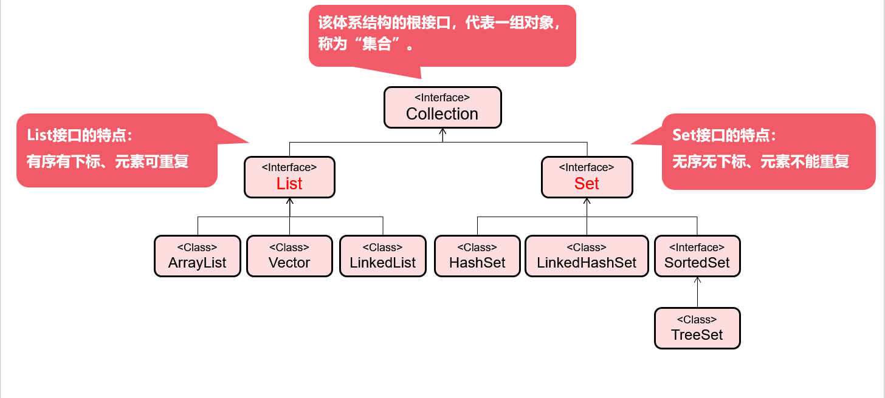
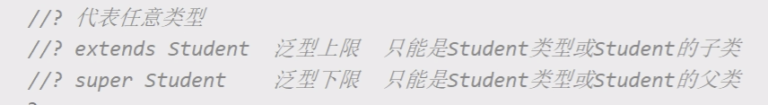

# day14

## 集合

#### 概念

- 对象的容器，定义了对多个对象进行操作的常用方法；可实现数组的功能

### 和数组区别

- 数组长度固定，集合长度不固定
- 数组可以存储基本类型和引用类型，集合只能存储引用类型，自动装箱
- 位置：java.util.*;

## Collection体系集合



#### 特点

​	代表一组任意类型的对象，无序、无下标。

#### 方法

- boolean add(Object obj) //添加一个对象
- boolean addAll(Collection c) //将一个集合中的所有对象添加到此集合中
- void clear() //清空此集合中的所有对象
- boolean contains(Object o) //检查此集合中是否包含o对象
- boolean equals(Object o) //比较此集合是否与指定对象相等
- boolean isEmpty() //判断此集合是否为空
- boolean remove(Object o) //在此集合中移除o对象
- int size() //返回此集合中的元素个数
- Object[] toArray() //将此集合转换成数组

#### Iterator接口

Iterator：集合中提供统一访问元素的方式

- hasNext();判断是否还有元素，如果有返回true,否则返回false
- next();获取元素
- remove();删除元素

- 注意

  - 不能执行多次next()

  - 在使用迭代器过程中，不能使用集合的删除方法，只能使用迭代器的删除方法，否则出现并发修改异常（ConcurrentModificationException）

### List集合

有序有下标，元素可重复

方法：

- void add(int index, Object o) //在index位置插入对象o

- boolean addAll(int index, Collection c) //将一个集合中的元素添加到此集合中的index位置

- Object get(int index) //返回集合中指定位置的元素

- List subList(int fromIndex, int toIndex) //返回fromIndex和toIndex之间的集合元素

- iterator迭代器

- listiterator列表迭代器 1.可以从前向后，从后向前 2.可以删除、添加、修改元素

  ```java
  System.out.println("=========迭代器==========");
  Iterator iterator = list.iterator();
  while(iterator.hasNext()){
      System.out.print(iterator.next() + "\t");
  }
  System.out.println();
  System.out.println("====列表迭代器正序====");
  ListIterator listIterator1 = list.listIterator();
  while (listIterator1.hasNext()){
      System.out.print(listIterator1.nextIndex()+ " =====" +listIterator1.next() + "\t");
  }
  System.out.println("====列表迭代器逆序=====");
  ListIterator listIterator2 = list.listIterator();
  while (listIterator2.hasPrevious()){
      System.out.println(listIterator2.previousIndex()+ " =====" +listIterator2.previous());
  }
  ```

#### ArrayList

- 数组结构实现，查询快、增删慢

- 删除和判断存在的依据式equals方法，重写equals方法后，可以做到根据值判断

- 分析： 
  - DEFAULT_CAPACITY = 10;默认容量 
  - 如果没有向集合中添加任何元素时，容量0,添加一个元素之后，容量扩容为10
  - 每次扩容大小是原来的1.5倍
  - elementData存放元素的数组
  - size 实际元素个数


#### LinkedList

双向链表结构实现，增删快，查询慢

#### 栈

- Stack类：继承Vector类
- push方法入栈、pop方法出栈
- LinkedList也实现了栈结构

#### 队列

- Queue接口：继承Collection接口
- offer方法入队、poll方法出队
- LinkedList实现了Queue接口

#### 泛型

- Java泛型是JDK1.5中引入的一个新特性，其本质是参数化类型，把类型作为参数传递

- 常见形式有泛型类、泛型接口、泛型方法

- 语法
  - <T,...> ：T称为类型占位符，表示一种引用类型，使用一个大写字母表示
  - 多个占位符之间使用逗号隔开
  
- 好处
  - 提高代码的重用性
  - 防止类型转换异常，提高代码的安全性
  
- 泛型方法+可变长参数，实现覆盖全部参数类型

  ```java
  stu.hi("xxxxsdadasd",":","2","2",true,123,123.22123);
  
  <T> void hi(T...t){
  System.out.println(Arrays.toString(t));
  }
  ```

  泛型通配符<?>,方法使用后方法体中不能修改参数

  

- 数组转集合 Arrays.asList(数组名) 不能添加和删除元素
- 集合转数组 toArray(new 数组) 如果传递到数组长度小于集合元素，返回一个和集合大小的数组

#### Colletions工具类

概念：集合工具类，定义了除了存取以外的集合常用方法

方法：

- public static void reverse(List<?> list) //反转集合中元素的顺序
- public static void shuffle(List<?> list) //随机重置集合元素的顺序
- public static void sort(List<T> list) //升序排序（元素类型必须实现Comparable接口）

### Set接口

无序无下标，元素不可重复

- 方法：全部继承自Collection中的方法

- 使用foreach循环遍历：

  ```java
  for(数据类型 局部变量 : 集合名){
  
   //循环内部的局部变量，代表当次循环从集合中取出的对象
  
  }
  ```

#### HashSet

- 存储结构哈希表（数组+链表），基于hashCode、equals实现元素不重复
- 根据元素的hash值计算位置,如果这个位置没有元素直接加入
- 如果有元素会调用equals进行确认，结果为true，拒绝存入，如果为false，形成单向链表

#### LinkedHashSet

- 双向链表实现的HashSet，按照链表进行存储，即可保留元素的插入顺序

#### TreeSet

- 存储结构红黑树，基于排序实现元素不重复
- 对集合元素自动排序
- 元素的类型必须实现Comparable接口，或自定义比较器Comparator

#### comparator（比较器）

- 元素自身提供的比较规则称为自然排序
- Comparator可以实现定制比较规则
- Compare(o1,o2)，如果返回值为0,则为重复元素
- 使用Comparator比较器，元素类型可不实现Comparable接口，并且优先级高于Comparable接口