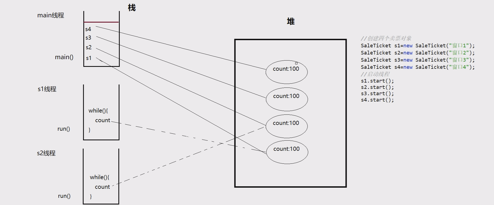

# day16

## 多线程

## 多线程

### 什么是进程

程序是静止的，正在运行的程序被称为进程；是操作系统分配资源的基本单位

### 什么是线程

线程，又称轻量级进程（Light Weight Process）。进程中的一个执行路径，同时也是CPU的基本调度单位。进程由多个线程组成，彼此间完成不同的工作，交替执行，称为多线程。

### 进程和线程的区别

- 进程是操作系统分配资源的基本单位，而线程是CPU的基本调度单位
- 一个程序运行后至少有一个进程
- 一个进程可以包含多个线程，但是至少需要有一个线程（主线程）
- 进程间不能共享数据段地址，但同进程的线程之间可以

### 线程的组成

任何一个线程都具有基本的组成部分：

1. CPU时间片：操作系统（OS）会为每个线程分配执行时间

2. 内存空间

   ​	堆空间：存储线程需使用的对象，多个线程可以共享堆中的对象

   ​	栈空间：存储线程需使用的局部变量，每个线程都拥有独立的栈

3. 线程的逻辑代码

### 线程执行特点

- 线程抢占式执行，结果具有随机性
  1. 效率高
  2. 可防止单一线程长时间独占CPU

- 在单核CPU中，宏观上同时执行，微观上顺序执行；多核CPU中，可实现真正的同时执行

### 创建线程

1. 创建线程的第一种方式：继承Thread类，重写run方法

2. 创建线程的第二种方式：实现Runnable接口

   

### 获取线程线程ID和线程名称

- 在Thread的子类中调用this.getId()或this.getName()
- 使用Thread.currentThread().getId()和Thread.currentThread().getName()

### 修改线程名称

- 调用线程对象的setName()方法
- 使用线程子类的构造方法赋值

### 线程常用方法

- 休眠
  - public static void sleep(long millis)
  - 当前线程主动休眠 millis 毫秒。释放了CPU，不再争抢CPU
- 放弃
  - public static void yield()
  - 当前线程主动放弃cpu时间片，回到就绪状态，竞争下一次时间片
- 加入
  - public final void join()
  - 允许其他线程加入到当前线程中。当前线程会阻塞，直到加入线程执行完毕
- 优先级
  - 线程对象.setPriority(int)
  - 线程优先级为1-10，默认为5,优先级越高，表示获取CPU机会越多。
- 线程打断
  - 线程对象.interrupt();
  - 打断线程，被打断线程抛出InterruptedException异常。
- 守护线程
  - 线程有两类：用户线程（前台线程）、守护线程（后台线程）。
  - 如果程序中所有前台线程都执行完毕了，后台线程会自动结束。
  - 垃圾回收器线程属于守护线程。
  - setDaemon(true)设置为守护线程。

### 线程同步

同步：线程一个接一个的等待执行。

异步：线程之间不需要等待执行。

#### 同步代码块

synchronized(锁对象){ //对临界【共享】资源对象加锁 

 //同步代码（原子操作）

}

注：

1.  任何的引用类型对象都可以作为锁，一般使用临界资源或唯一引用类型对象作为锁
2.  每个对象都有一个互斥锁标记，只有拥有对象互斥锁标记的线程，才能进入同步代码块
3.  线程退出同步代码块时，会释放相应的互斥锁标记

#### 同步方法

synchronized 返回值类型 方法名称(形参列表){ 

 // 同步代码（原子操作）

}

注：

1.  只有拥有对象互斥锁标记的线程，才能进入该对象加锁的同步方法中。
2.  线程退出同步方法时，会释放相应的互斥锁标记。
3.  实例方法锁是this；静态方法锁是“类名.class”

#### 线程的7个状态

getstate()获取线程当前状态

### 死锁

当第一个线程拥有A对象锁，并等待B对象锁，同时第二个线程拥有B对象锁，并等待A对象锁时，并且都比不会释放已经拥有的锁，则产生死锁。

#### 死锁条件：

- 互斥条件
- 占有且等待
- 不可被抢夺
- 循环等待

死锁避免：打破其中一个条件即可避免死锁。

### 线程通信

#### 等待：

- public final void wait()
- public final void wait(long timeout)
- 必须在对obj加锁的同步代码块中
- 调用obj.wait() 时，此线程会释放其拥有的所有锁标记，释放CPU，进入等待队列

#### 通知：

- public final void notify()：从等待队列中随机唤醒一个
- public final void notifyAll()：唤醒所有等待线程
- 必须在对obj加锁的同步代码块中
- 从obj的等待队列中随机唤醒一个或全部线程

### wait()和sleep()的区别

1. wait() 释放锁和cpu，进入等待队列，状态无限时等待waiting
2. sleep() 释放cpu，不会释放锁，状态是限时等待timed_waiting