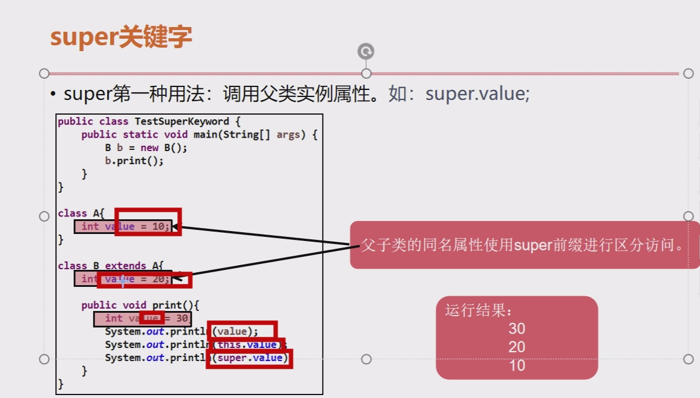
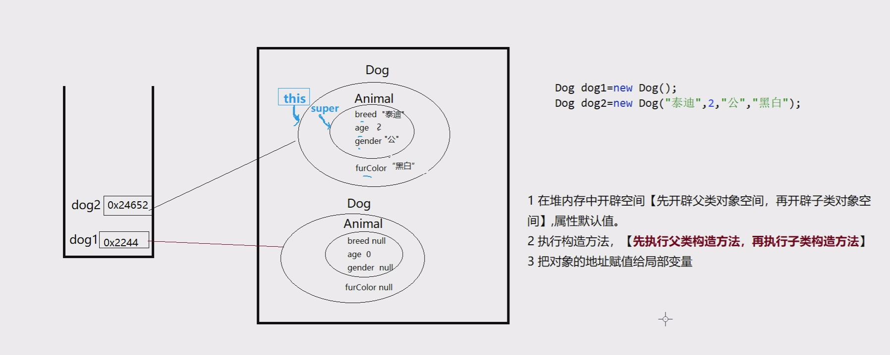
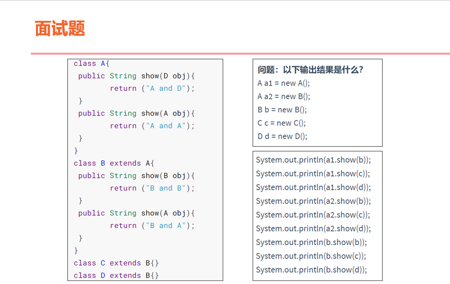

# day09

## 三大特性

### 封装

隐藏对象的内部实现细节，控制对象的修改访问权限

- ##### 步骤

  1. 使用private 修饰属性
  2. 添加公开的get、set方法
  3. 在方法中添加逻辑判断，避免非法数据的录入

### 继承(extends)

#### 语法

class 子类 extends 父类{ } //定义子类时，显示继承父类

#### 应用

产生继承关系之后，子类可以使用父类中的属性和方法，也可定义子类独有的属性和方法

#### 好处

提高程序的重用性、可扩展性

#### Java是单继承，一个类只能有一个直接父类，但可以多级继承，属性、方法主机叠加

#### 不可被继承

- 构造方法不可被继承，但可被子类调用
- private修饰的属性和方法

| **访问修饰符** | **本类** | **同包** | **非同包子类** | **其他** |
| -------------- | -------- | -------- | -------------- | -------- |
| **private**    | **√**    | **×**    | **×**          | **×**    |
| [default[]     | **√**    | **√**    | **×**          | **×**    |
| **protected**  | **√**    | **√**    | **√**          | **×**    |
| **public**     | **√**    | **√**    | **√**          | **√**    |

- 类中的属性和方法，四个访问修饰符都可以使用
- 类只能使用public和[default]，内部类除外
- 类中属性一般都是私有的，方法一般都是公开的

### 方法重写

#### 概念

​	当父类提供的方法无法满足子类需求时，可在子类中定义和父类相同的方法进行重写（Override）

#### 方法重写原则

- 在子类和父类中，**方法名称、参数列表、返回值类型**必须与父类方法相同。
- 访问修饰符可与父类方法相同或是比父类方法更宽泛
- Jdk1.7之后，返回值类型可以和父类不一样，兼容（子类）即可;

#### 方法重写的执行

- 子类重写父类方法后，调用时优先执行子类重写后的方法
- @override：检验是否满足重写规则

#### super

​	在子类中，可直接访问从父类继承到的属性和方法，但如果父子类的属性或方法存在重名（属性遮蔽、方法重写）时，可以使用super关键字进行区分，super.父类

- 调用父类的实例属性

- 调用父类的实例方法

  

- 调用父类的构造方法，super(实参);

- 在子类的构造方法中，没有代码时，默认添加super()、super(实参)

### 多态

#### 规则

- 同一类事物的同一个行为，有多种不同的表现形式；

- 父类引用指向不同子类对象时，从而产生多态

- 二者具有直接或间接的继承关系时，父类引用可指向不同子类对象

- 父类引用仅可调用父类所声明的属性和方法包括子类重写的方法，不可调用子类独有的属性和方法

- 必须有重写方法

#### 多态前提条件

- 子类继承父类（普通类，抽象类，接口）

- 子类重写父类的方法

#### 多态应用场景

- 场景一：使用父类作为方法形参实现多态，实际传递子类对象，使方法参数类型更为宽泛

- 场景二：使用父类作为方法返回值类型实现多态，实际返回子类对象，使方法返回不同子类对象

#### 多态的好处

- 屏蔽子类间的差异

- 提高程序可扩展性和灵活性、降低程序耦合性

#### 向上转型

- 父类引用中保存真实子类对象，称为向上转型（即多态核心概念）
-  注意：仅可调用Animal中所声明的属性和方法和子类重写父类的方法

#### 向下转型

- 将父类引用中的真实子类对象，强转回子类本身类型，称为向下转型
- 注意：只有转换回子类真实类型，才可调用子类独有的属性和方法
- instanceof关键字判断父类引用中保存到真实的子类类型
  - 向下转型前，应判断引用中的对象真实类型，保证类型转换的正确性。
  - 语法：父类引用 instanceof 类型 //返回boolean类型结果

### this和super的区别

- this表示当前对象的引用，super表示父类对象的引用

- this调用当前对象的实例属性和方法包括继承的，super调用父类的实例属性和方法

- this(实参)调用本类的构造方法，super(实参)调用父类的构造方法

- this(实参)和super(实参)都要求构造方法中的首行，所以不能同时使用

  

