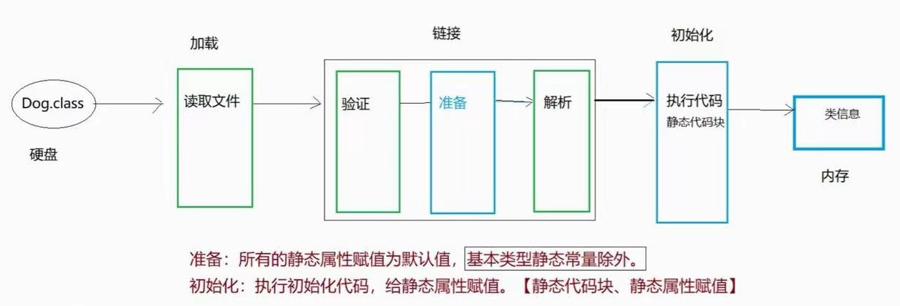

# day10

## 三个修饰符

### abstecat

#### **作用**

1. 可被子类继承，提供共性属性和方法
2. 可声明为引用，更自然的使用多态

#### **抽象类的特点**

1. 抽象类不能new对象，但可以声明引用【变量】，可以被子类继承
2. 抽象类中可以包含属性和非抽象方法，也可以包含抽象方法
3. 抽象类中可以包含构造方法，只能被子类调用

#### **抽象方法的特点**

1. 抽象方法只有方法声明，没有方法体。
2. 包含抽象方法的类一定是抽象类。
3. 抽象方法必须被子类重写，除非子类也是抽象类。

### static

#### 概念

共享的，共有的。

#### 基本用法

- 修饰属性，称为静态属性（类属性）用类名.属性访问

​			Java语言的开放性，静态成员可以使用对象.静态成员访问

- 修饰方法，称为静态方法（类方法）用类名.方法访问，同一个类可以省略类名.

  - 静态方法中允许直接访问静态属性和其他静态方法

  - 静态方法不能直接访问实例属性和实例方法，需要创建对象访问

  - 非静态方法中可以直接访问静态属性和静态方法

  - 静态方法中不允许使用this或是super关键字

  - 静态方法可以被继承，可以重载，不能被重写

- 代码块

  - 局部代码块

    定义在方法内部的代码块

    作用：缩小变量使用范围提前释放变量，节省内存

    ```java
    {
    	//执行操作
    }
    ```

  - 动态（构造）代码块

    定义在方法外，类内部的代码块，在创建对象的时候会触发动态代码块

    作用：初始化实例属性

    ```java
    {
    	//执行操作
    }
    ```

    补充

    ​	程序编译时，会自动把动态代码块中的代码优化到构造方法中，会优化到全部构造方法中

    ​	在定义属性的时候直接给属性赋值（实例属性的初始化），也会优化到构造器中在最前面

    ​	顺序：【实例属性、动态代码块 】(看谁在前)-> 自定义代码

  - 静态代码块
  
    ​	使用static修饰的动态代码块，类加载时，触发静态代码块的执行（仅一次）
  
    作用：可为静态属性初始化
  
    ```java
    static{
    	//执行操作
    }
    ```
  
    - 类加载：
      - JVM首次使用某个类时，需通过CLASSPATH查找该类的.class文件。
      - 将.class文件中对类的描述信息加载到内存中，进行保存。
      - 如：包名、类名、父类、属性、方法、构造方法...
  
    - 触发类加载：
      - 创建对象。Student s=new Student();
      - 创建子类对象
      - 访问静态属性
      - 调用静态方法
      - 主动加载：Class.forName(“全限定名”);
  
    

#### static用法

- 静态属性
- 静态方法
- 静态代码块
- 【静态导入】 import static java.lang.System.out;
- 静态内部类

#### 特点

- 静态成员是类所有对象共享的成员，在全类中只有一份，不因创建多个对象而产生多份
- 静态成员访问不必创建对象，可直接通过类名访问

#### 使用场景

-  一般工具类中属性和方法都是静态的。比如：Arrays、Math
-  如果这个属性或方法只需要一份，使用静态修饰。比如：main方法

### final

#### 概念

最后的，不可更改的。

#### final可修饰的成员

修饰类：最终类

修饰方法：最终方法

修饰变量：最终变量=常量

#### final用法

- ##### final类

​	最终类，此类不能被继承，String、Math、System均为final修饰的类，不能被继承

- ##### final方法

​	最终方法，此方法不能被重写，可以被继承，意为最终方法，不支持子类以重写的形式修改

- ##### final常量

常量命名习惯： 所有字母大写，如果有多个单词使用下划线隔开，必须赋值，一旦赋值，数据不能被改变

- 局部常量
- 实例常量
  - 实例常量的赋值（只能赋值一次）
    1. 声明时赋值
    2. 构造方法中赋值
    3. 动态代码块中赋值
- 静态常量（static修饰）
  - 静态常量的赋值（只能赋值一次）
    1. 声明时赋值
    2. 静态代码块中赋值

- 数组常量

  final修饰后数组不能再赋值，数组元素可以修改

- 对象常量

  final修饰后对象不能再赋值，对象属性可以修改
