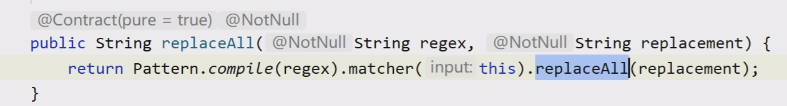

# day13

## 正则表达式

- 正则表达式就是一个验证字符串格式是否满足要求的字符串，使用一个字符串匹配一组字符串,这个字符串就是正则表达式。

- 正则表达式的用途

  - 匹配
  - 拆分
  - 获取
  - 替换

- ### 符号

  - #### 元字符

  | **字符**        | **解释**                                      |
  | --------------- | --------------------------------------------- |
  | a               | 匹配字符a                                     |
  | [abc]           | 匹配  a或b或c                                 |
  | \[^abc]         | 任何字符，除了  a、b 或 c（否定）             |
  | [a-zA-Z]        | a 到  z 或 A 到 Z，两头的字母包括在内（范围） |
  | [a-d[m-p]]      | a 到  d 或 m 到 p：[a-dm-p]（并集）           |
  | [a-z&&[def]]    | d、e  或 f（交集）                            |
  | [a-z&&[  ^bc]]  | a 到  z，除了 b 和 c：[ad-z]（减去）          |
  | [a-z&&[  ^m-p]] | a 到  z，而非 m 到 p：[a-lq-z]（减去）        |

  - #### 预定义字符

    | **字符** | **解释**                                       |
    | -------- | ---------------------------------------------- |
    | **.**    | **任意字符（与行结束符可能匹配也可能不匹配）** |
    | **\d**   | **数字：[0-9]**                                |
    | **\w**   | **单个字符：[a-zA-Z_0-9]**                     |

  - #### 边界匹配

    | **字符** | **解释**       |
    | -------- | -------------- |
    | **^**    | **表示行开始** |
    | **$**    | **表示行结束** |

  - #### 数量

    | **字符**    | **解释**               |
    | ----------- | ---------------------- |
    | **X?**      | **一次或0次**          |
    | **X\***     | **0次或多次(包括1次)** |
    | **X+**      | **一次或多次**         |
    | **X{n}**    | **恰好n次**            |
    | **X{n,  }** | **至少n次**            |
    | **X{n,m}**  | **至少n次，不超过m次** |

- ### Pattern类：模式、正则表达式编译类

  - Pattern p = Pattern.compile(正则表达式);

  - Matcher matcher = p.matcher(要匹配的str);

- ### Matcher类：匹配器

  - matcher.find()寻找字符串中符合匹配器中的正则表达式的字符，有返回true
  - matcher.group()返回当前匹配器符合正则表达式的字符串

  - 替换 s.repalceAll(正则表达式,替换内容)

    

## BigDecimal类

- 位置：java.math包中

- 作用：精确计算浮点数

- 创建方式：BigDecimal bd=new BigDecimal(“1.0”);

- 方法：     

  - BigDecimal add(BigDecimal bd)  加

  - BigDecimal subtract(BigDecimal bd) 减

  - BigDecimal multiply(BigDecimal bd) 乘

  - BigDecimal divide(BigDecimal bd) 除 要指定保留位数

    - 除法：divide(BigDecimal bd,int scale,RoundingMode mode)

    - 参数scale ：指定精确到小数点后几位。

    - 参数mode 

      - 指定小数部分的取舍模式，通常采用四舍五入的模式，

      - 取值为BigDecimal.ROUND_HALF_UP或RoundingMode.HALF_UP

  - BigDecimal remainder (BigDecimal bd) 模

## Math类

Math类包含用于执行基本数学运算的方法，如初等指数、对数、平方根和三角函数

| **方法名**                            | **说明**                                             |
| ------------------------------------- | ---------------------------------------------------- |
| static  int abs(int a)                | 获取绝对值                                           |
| static  double pow(double a,double b) | 返回第一个参数的第二个参数次幂的值                   |
| static  double random()               | 返回带正号的  double 值，该值大于等于 0.0 且小于 1.0 |
| static  long round(double a)          | 返回最接近参数的long                                 |
| static  double sqrt(double a)         | 返回正确舍入的  double 值的正平方根                  |
| static  double cbrt(double a)         | 返回  double 值的立方根。                            |
| static  double ceil(double a)         | 返回大于或等于参数的最小整数                         |
| static  double floor(double a)        | 返回小于或等于参数的最大整数                         |
| static int round(double a)            | 返回四舍五入后的值                                   |

## Random类

- 此类的实例用于生成伪随机数流。

- 此类使用 48 位的种子（默认是时间），使用线性同余公式 (linear congruential form) 对其进行了修改所得。

  | **方法名**           | **说明**                                 |
  | -------------------- | ---------------------------------------- |
  | int  nextInt()       | 返回下一个伪随机整数                     |
  | double  nextDouble() | 返回0.0  和 1.0 之间均匀分布的 double 值 |

- 若long种子确定，则在不同程序中，相同次数产生的随机数是相同的。

## Date类（Calendar代替）

- Date表示特定的瞬间，精确到毫秒。
- Date类中的大部分方法都已经被Calendar类中的方法所取代。
- 时间单位
  - 1秒=1000毫秒
  - 1毫秒=1000微秒
  - 1微秒=1000纳秒

## SimpleDateFormat类

- SimpleDateFormat是以与语言环境有关的方式来格式化和解析日期的类。

- 进行格式化（日期 -> 文本）、解析（文本 -> 日期）。

- 常用的时间模式字母

  | **字母** | **日期或时间**    | **示例** |
  | -------- | ----------------- | -------- |
  | y        | 年                | 2019     |
  | M        | 年中月份          | 08       |
  | d        | 月中天数          | 10       |
  | H        | 1天中小时数(0-23) | 22       |
  | m        | 分钟              | 16       |
  | s        | 秒                | 59       |
  | S        | 毫秒              | 367      |

- parse(str)字符串转换日期
- format(date)日期转换字符串

## Calendar类（JDK1.8代替）

- Calendar提供了获取或设置各种日历字段的方法。

- protected Calendar() 构造方法为protected修饰，无法直接创建该对象

- 和Date转换 Date date = calendar.getTime();

- 其他方法

  | **方法名**                                                   | **说明**                                    |
  | ------------------------------------------------------------ | ------------------------------------------- |
  | static  Calendar getInstance()                               | 使用默认时区和区域获取日历                  |
  | void  set(int year,int month,int date,int hourofday,int minute,int second) | 设置日历的年、月、日、时、分、秒。          |
  | int  get(int field)                                          | 返回给定日历字段的值。字段比如年、月、日等  |
  | void  setTime(Date date)                                     | 用给定的Date设置此日历的时间。Date-Calendar |
  | Date  getTime()                                              | 返回一个Date表示此日历的时间。Calendar-Date |
  | void  add(int field,int amount)                              | 按照日历的规则，给指定字段添加或减少时间量  |
  | long  getTimeInMillis()                                      | 毫秒为单位返回该日历的时间值                |

## System类

- | **方法名**                        | **说明**                                                     |
  | --------------------------------- | ------------------------------------------------------------ |
  | static  void arraycopy(...)       | 复制数组                                                     |
  | static  long currentTimeMillis(); | 获取当前系统时间，返回的是毫秒值                             |
  | static  void gc();                | 建议JVM赶快启动垃圾回收器回收垃圾，调用runtime.gc()          |
  | static  void exit(int status);    | 退出jvm，如果参数是0表示正常退出jvm，非0表示异常退出jvm。 调用runtime.exit() |

## Runtime类

- 每个 Java 应用程序都有一个Runtime类实例，使应用程序能够与其运行的环境相连接。可以通过getRuntime方法获取当前运行时

  | **方法名**                    | **说明**                                                 |
  | ----------------------------- | -------------------------------------------------------- |
  | Process  exec(String command) | 在单独的进程中执行指定的字符串命令。                     |
  | void  exit(int status)        | 终止当前正在运行的  Java 虚拟机。                        |
  | void  gc()                    | 建议JVM赶快启动垃圾回收器回收垃圾                        |
  | long  totalMemory()           | 返回  Java 虚拟机中的内存总量。  默认总内存的1/64        |
  | long  freeMemory()            | 返回  Java 虚拟机中的空闲内存量                          |
  | long  maxMemory()             | 返回  Java 虚拟机试图使用的最大内存量。  默认总内存的1/4 |

- 修改JVM运行内存 
  - 修改堆初始内存大小：-Xms500m
  - 修改堆最大内存大小：-Xmx500m
  - 修改栈空间大小：-Xss2m  jdk1.5之前256k jdk1.5之后1m 

## 异常

概念：程序在运行过程中出现的特殊（不正常）情况

异常处理的必要性：任何程序都可能存在大量的未知问题、错误；如果不对这些问题进行正确处理，则可能导致程序的中断，造成不必要的损失

- Throwable：可抛出的，一切错误或异常的父类，位于java.lang包中

  - Error： JVM、硬件、执行逻辑错误，不能手动处理

  - Exception：程序在运行和配置中产生的问题，可处理

  - RuntimeException：运行时异常，可处理，可不处理
  - 【CheckedException】：检查（编译）时异常，必须处理

### 常见异常

| **类型**                           | **说明**           |
| ---------------------------------- | ------------------ |
| **NullPointerException**           | **空指针异常**     |
| **ArrayIndexOutOfBoundsException** | **数组越界异常**   |
| **ClassCastException**             | **类型转换异常**   |
| **NumberFormatException**          | **数字格式化异常** |
| **ArithmeticException**            | **算术异常**       |

### 异常的产生

- 当程序在运行时遇到不符合规范的代码或结果时，会产生异常

- 出现异常相当于遇到 return 语句，导致程序因异常而终止

### 异常的传递

​	按照方法的调用链反向传递，如始终没有处理异常，最终会由JVM进行默认异常处理（打印堆栈跟踪信息）并中断程序。

### 异常处理语句

- try:`可能出现异常的代码`
- catch:捕获处理异常
- finally:异常最终处理，释放资源
- throw:抛出异常
- throws:声明异常

### 常见异常处理结构

- try{ 可能出现异常的代码 } catch{ 捕获异常并处理的相关代码，如：getMessage()、printStackTrace() }
  - 三种情况：
    - 正常执行，不会执行catch
    - 捕获并执行处理
    - 异常类型不匹配
- try{ 可能出现异常的代码 } catch{ 捕获异常并处理的相关代码，如：getMessage()、printStackTrace() } finally{ 是否发生异常都会执行，可以释放资源等... }
  - finally块无论是否发生异常都执行
  - finally块不执行的唯一情况，提前退出Java虚拟机
- try{ 可能出现异常的代码 } catch{ 满足异常类型1执行的相关代码 } catch{ 满足异常类型2执行的相关代码 }...
  - 多重catch，遵循从子( 小 )到父( 大 )的顺序，父类异常在最后
- try{ } catch{ } catch{ }...finally{ }
- try{ } finally{ } 
  - try...finally...不能捕获异常，仅仅用来当发生异常时，用来释放资源
  - 一般用在底层代码，只释放资源不做异常处理，把异常向上抛出

### throws-声明异常

- 如果在一个方法体中抛出了异常，如何通知调用者？
  - throws关键字：声明异常，通知调用者此方法有异常
- 使用原则：底层代码向上声明或者抛出异常，最上层一定要处理异常，否则程序中断
- 注意事项：
  - 如果方法抛出的是检查时异常，调用者必须处理，如果是运行时异常，可以不处理
  - 可以声明抛出多个异常类型，中间用逗号隔开

### throw-抛出异常

- 除了系统自动抛出异常外，有些问题需要程序员自行抛出异常
- throw关键字：抛出异常
- 语法： throw 异常对象;

### 自定义异常

- 概念：需继承Exception或Exception的子类，代表特定问题。 
- 经验：异常类型名称望文生义，可在发生特定问题时抛出对应的异常。
- 常用构造方法：
  - 无参数构造方法 
  - String message参数的构造方法

- 带有异常声明的方法重写：
  - 子类继承父类，方法名、参数列表、返回值类型必须和父类相同。
  - 子类的访问修饰符合父类相同或是比父类更宽。
  - 子类中的方法，不能抛出比父类更多、更宽的检查时异常。
