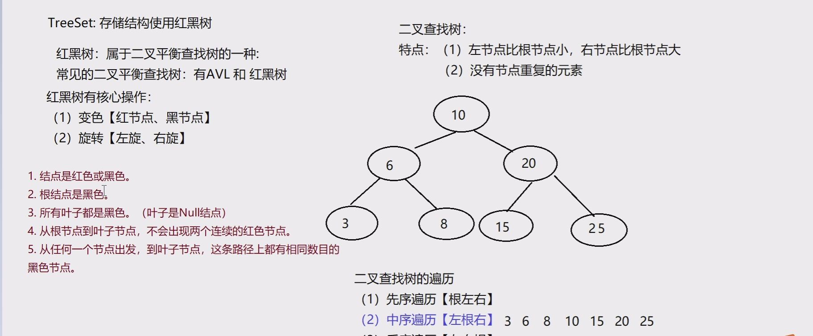
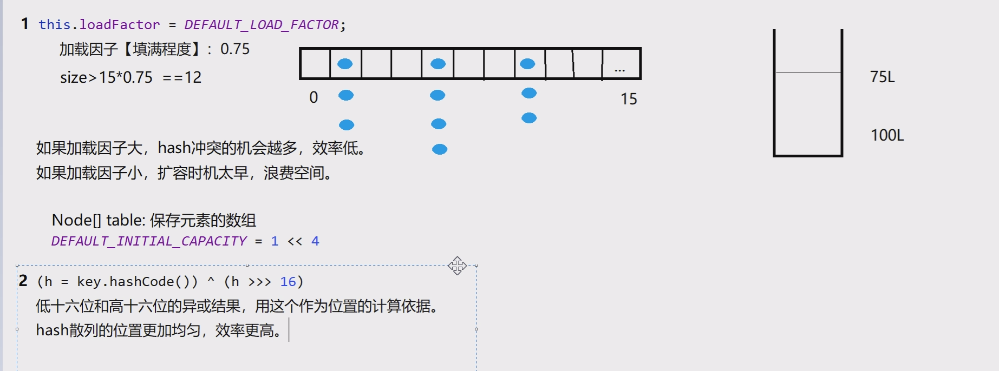
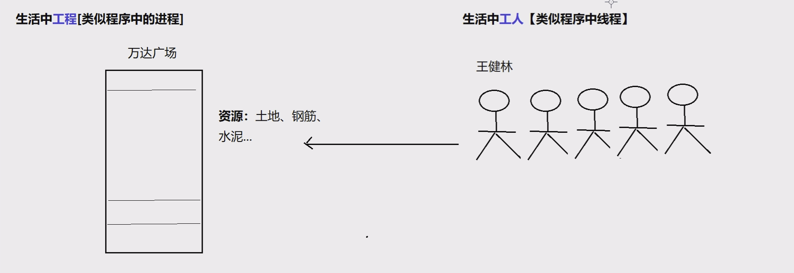
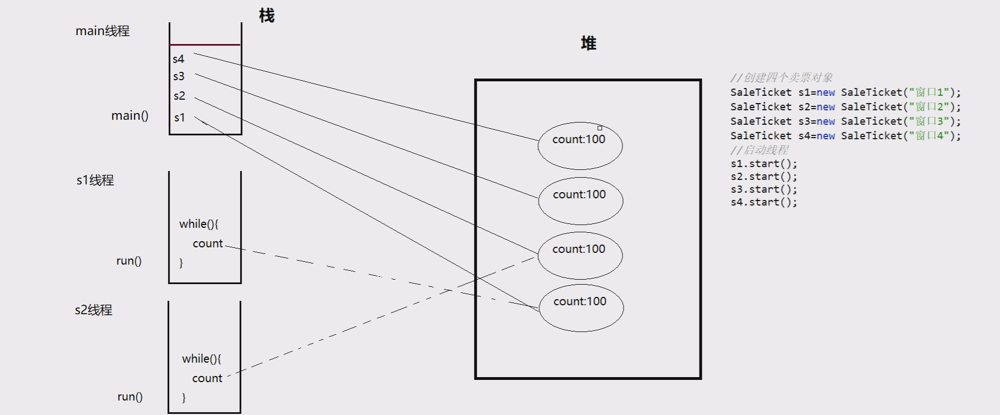

# day15

### Set集合

无序无下标，元素不可重复

- 方法：全部继承自Collection中的方法

- 使用foreach循环遍历：

  ```java
  for(数据类型 局部变量 : 集合名){
  
   //循环内部的局部变量，代表当次循环从集合中取出的对象
  
  }
  ```

#### HashSet

- 存储结构哈希表（数组+链表），基于hashCode、equals实现元素不重复
- 根据元素的hash值计算位置,如果这个位置没有元素直接加入
- 如果有元素会调用equals进行确认，结果为true，拒绝存入，如果为false，形成单向链表

#### LinkedHashSet

- 双向链表实现的HashSet，按照链表进行存储，即可保留元素的插入顺序

#### TreeSet

- 存储结构红黑树，基于排序实现元素不重复

- 对集合元素自动排序

- 元素的类型必须实现Comparable接口，或自定义比较器Comparator

  

comparator（比较器）

- 元素自身提供的比较规则称为自然排序
- Comparator可以实现定制比较规则
- Compare(o1,o2)，如果返回值为0,则为重复元素
- 使用Comparator比较器，元素类型可不实现Comparable接口，并且优先级高于Comparable接口

### Map集合

Map接口的特点

- l用于存储键值对(Key-Value)
- l键不可以重复，值可以重复
- l无序无下标

方法：

- V put(K key,V value) //将对象存入到集合中，关联键值。key重复则覆盖原值
- Object get(Object key) //根据键获取对应的值
- Set<K> keySet()//返回所有key的set集合
- values();返回collection集合
- Collection<V> values() //返回包含所有值的Collection集合
- Set<Map.Entry<K,V>> entrySet() //键值匹配的Set集合

#### HashMap

- 存储结构哈希表，键重复依据hashCode和equals方法

- 根据键的hash值计算位置,如果这个位置没有元素直接加入

- 如果有元素会调用键的equals进行确认，结果为true，拒绝存入，如果为false，形成链表

- JDK1.2版本，线程不安全，运行效率快 ;允许用null 作为key或是value

  

源码分析

- 无参构造创建HashMap时，加载因子0.75，table是null，为了节省空间，当添加第一个元素时，table容量调整为16

- 当元素个数大于阈值(16*0.75=12)时，会进行扩容，扩容后大小为原来的2倍
- jdk1.8 当每个链表长度大于8，并且数组元素个数大于等于64时，会调整为红黑树，目的提高执行效率
- jdk1.8 当红黑树节点个数小于等于6时，调整成链表
- jdk1.8以前，链表是头插入，jdk1.8以后是尾插入

#### LinkedHashMap

- 双向链表保存HashMap的顺序，有顺序的HashMap

#### TreeMap

- 存储结构红黑树，基于排序实现元素不重复
- 可以对key自动排序，Key需实现Comparable接口；或使用Comparator定制比较

#### Properties（属性集合）

Hashtable的子类

特点：

- 存储属性名和属性值。

- key和value都是String，通常用于读取配置文件。

- 没有泛型。

- 和IO流有关系。

PropertyNames();专门用来遍历属性集合

## 多线程

### 什么是进程

程序是静止的，正在运行的程序被称为进程；是操作系统分配资源的基本单位

### 什么是线程

线程，又称轻量级进程（Light Weight Process）。进程中的一个执行路径，同时也是CPU的基本调度单位。进程由多个线程组成，彼此间完成不同的工作，交替执行，称为多线程。



### 进程和线程的区别

- 进程是操作系统分配资源的基本单位，而线程是CPU的基本调度单位
- 一个程序运行后至少有一个进程
- 一个进程可以包含多个线程，但是至少需要有一个线程（主线程）
- 进程间不能共享数据段地址，但同进程的线程之间可以

### 线程的组成

任何一个线程都具有基本的组成部分：

1. CPU时间片：操作系统（OS）会为每个线程分配执行时间

2. 内存空间

   ​	堆空间：存储线程需使用的对象，多个线程可以共享堆中的对象

   ​	栈空间：存储线程需使用的局部变量，每个线程都拥有独立的栈

3. 线程的逻辑代码

### 线程执行特点

- 线程抢占式执行，结果具有随机性
  1. 效率高
  2. 可防止单一线程长时间独占CPU

- 在单核CPU中，宏观上同时执行，微观上顺序执行；多核CPU中，可实现真正的同时执行

### 创建线程

1. 创建线程的第一种方式：继承Thread类，重写run方法

### 获取线程线程ID和线程名称

- 在Thread的子类中调用this.getId()或this.getName()
- 使用Thread.currentThread().getId()和Thread.currentThread().getName()

### 修改线程名称

- 调用线程对象的setName()方法
- 使用线程子类的构造方法赋值

