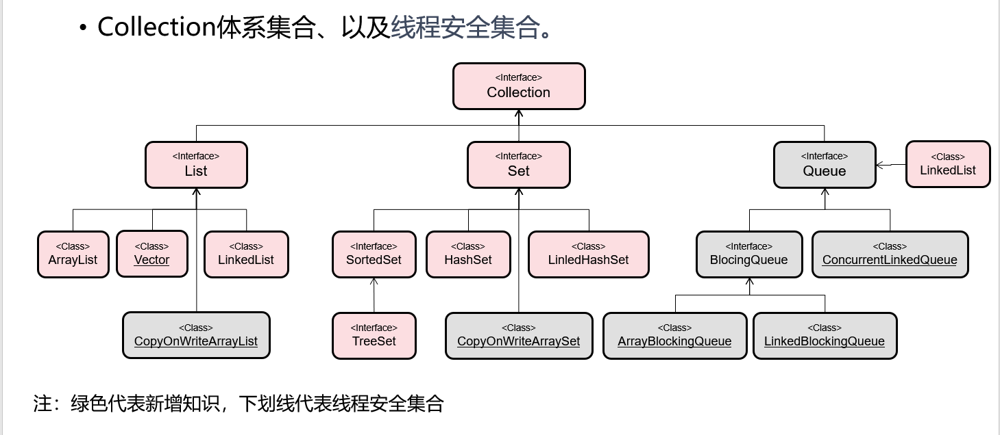
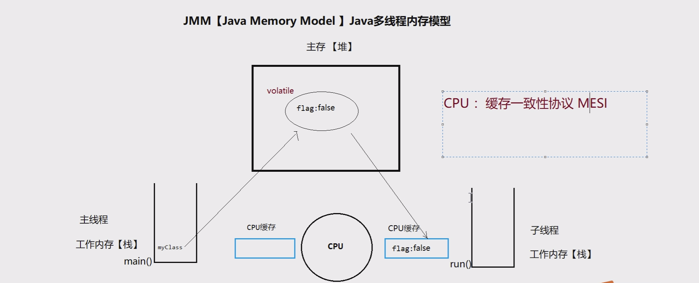
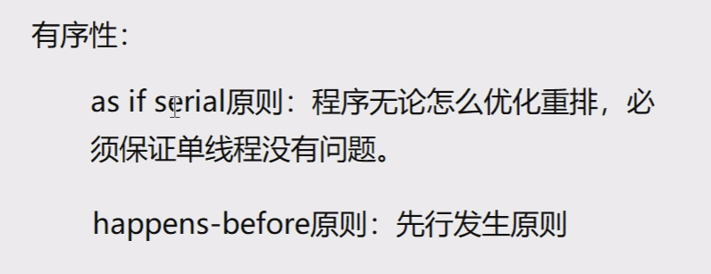

# day18

## 高级多线程

### 线程安全的集合



#### CopyOnWriteArrayList

- 线程安全的ArrayList，加强版读写分离

- 写有锁，读无锁，读写之间不阻塞，优于读写锁

- 写入时，先copy一个容器副本、再添加新元素，最后替换引用

- 使用方式与ArrayList无异

  ```java
  public class TestCopyOnWriteArrayList {
      public static void main(String[] args) {
          CopyOnWriteArrayList<String> list = new CopyOnWriteArrayList<>();
          ExecutorService es = Executors.newFixedThreadPool(10,(Runnable r) -> new Thread(r,"赵云="));
  
          for (int i = 0; i < 10; i++)
              es.submit(() -> {for (int j = 0; j < 10; j++)
                                  list.add(Thread.currentThread().getName()+"...." + j);});
  
          es.shutdown();
          while(!es.isTerminated());
  
          System.out.println(list.size());
      }
  }
  ```

#### CopyOnWriteArrySet

- 线程安全的Set，底层使用CopyOnWriteArrayList实现
- 唯一不同在于，使用addIfAbsent()添加元素，会遍历数组，如存在元素，则不添加（扔掉副本
- 重复依据equals方法

#### ConcurrentHashMap

- 初始容量默认为16段（Segment），使用分段锁设计
- 不对整个Map加锁，而是为每个Segment加锁
- 当多个对象存入同一个Segment时，才需要互斥
- 最理想状态为16个对象分别存入16个Segment，并行数量16
- 使用方式与HashMap无异
- JDK1.8改为CAS无锁算法

#### CAS算法

- CAS：Compare And Swap【比较交换算法】
  - 其实现方式是基于硬件平台的汇编指令【compxchg】，是靠硬件来实现的，效率高
  - 并且比较和交换过程是同步的
  - CAS是一种乐观锁
- CAS比较交换算法，修改的方法包含三个核心参数（V,E,N）
  - V：要更新的变量、E：预期值、N：新值
  - 只有当V==E时，V=N；否则表示已被更新过，则取消当前操作，继续尝试执行直到成功
  - 模拟底层的CAS

```java
public class TestCas {
    public static void main(String[] args) {
        ExecutorService es = Executors.newFixedThreadPool(100);
        Cas cas = new Cas();
        for (int i = 0; i < 100; i++) {
            es.submit(new Runnable() {
                @Override
                public void run() {
                   while (true){
                       int e = cas.getV();
                       int ver = cas.getVersion();
                       boolean b = cas.CandS(e, new Random().nextInt(100),ver);
                       System.out.println(Thread.currentThread().getName()+"....."+b);
                       if(b){
                           break;
                       }
                   }
                }
            });
        }
        es.shutdown();
    }
    static class Cas{
        private int v;
        private int version;

        public int getV() {
            return v;
        }
        public int getVersion() {
            return version;
        }
        public synchronized boolean CandS(int e, int n,int ver){
            if(e == v & ver == version){
                v = n;
                return true;
            }
            return false;
        }
    }
}
```


##### 乐观锁：

- 总是认为是线程安全，不怕别的线程修改变量，如果修改了再重新尝试，直到成功
- CAS是乐观锁

##### 悲观锁：

- 总是认为线程不安全，不管什么情况都进行加锁，要是获取锁失败，就阻塞
- synchronized、ReentrantLock是悲观锁

#### Queue接口（队列）

Collection的子接口，表示队列FIFO（First In First Out）

抛出异常：

- boolean add(E e) //顺序添加一个元素（到达上限后，再添加则会抛出异常）
- E remove() //获得第一个元素并移除（如果队列没有元素时，则抛异常）
- E element() //获得第一个元素但不移除（如果队列没有元素时，则抛异常）

返回特殊值：推荐使用

- boolean offer(E e) //顺序添加一个元素 （到达上限后，再添加则会返回false）
- E poll() //获得第一个元素并移除 （如果队列没有元素时，则返回null）
- E peek() //获得第一个元素但不移除 （如果队列没有元素时，则返回null）

```java
public class TestConcurrentLinkedQueue {
    public static void main(String[] args) {
        ConcurrentLinkedQueue<Object> queue = new ConcurrentLinkedQueue<>();
        ExecutorService es = Executors.newFixedThreadPool(10);
        for (int i = 0; i < 10; i++) {
            es.submit(new Runnable() {
                @Override
                public void run() {
                        queue.offer(Thread.currentThread().getName()+"....");
                    }
            });
        }
        es.shutdown();
        while (!es.isTerminated());
        System.out.println("==============");
        int count = queue.size();
        for (int i = 0; i < count; i++) {
            System.out.println(queue.poll());
        }
    }
}
```

#### BlockingQueue接口（阻塞队列）

- Queue的子接口，阻塞的队列，增加了两个线程状态为无限期等待的方法
- 方法：
  - void put(E e) //将指定元素插入此队列中，如果没有可用空间，则等待
  - E take() //获取并移除此队列头部元素，如果没有可用元素，则等待
- 可用于解决生产者、消费者问题

- ArrayBlockingQueue

​		数组结构实现，有界队列。（手工固定上限）

- LinkedBlockingQueue

​		链表结构实现，有界队列。（默认上限Integer.MAX_VALUE）

```java
public class TestBlockingQueue {
    public static void main(String[] args) {
        BlockingQueue<String> queue = new LinkedBlockingQueue<>(6);
        ExecutorService es = Executors.newFixedThreadPool(2);
        es.submit(new Runnable() {
            @Override
            public void run() {
                for (int i = 0;i < 30;i++) {
                    try {
                        queue.put("面包"+i);
                        System.out.println(Thread.currentThread().getName()+"生产了面包"+i);
                    } catch (InterruptedException e) {
                        throw new RuntimeException(e);
                    }
                }
            }
        });
        es.submit(new Runnable() {
            @Override
            public void run() {
                for (int i = 0;i < 30;i++) {
                    try {
                        String s = queue.take();
                        System.out.println(Thread.currentThread().getName()+"消费了"+ s);
                    } catch (InterruptedException e) {
                        throw new RuntimeException(e);
                    }
                }
            }
        });
        es.shutdown();
    }
}
```

#### 多线程三个特性

- 多线程要保证并发线程的正确执行，必须要保证三个特性

- 原子性【互斥性】

  - 一个或多个操作不能被分割，要么线程获取锁全部执行，要么阻塞都不执行

- 可见性【JMM】

  - 多个线程访问同一个变量，一个线程修改了这个变量，别的线程能立即看到修改的值

  - volatile关键字保证内存可见性，程序性能下降，因为会去cpu更新数据

    

- 有序性【禁止指令重排】volatile

  - 程序执行的顺序按照代码的先后顺序执行

  - 指令重排，没有依赖的代码之间可能会发生，处理器为了提高程序运行效率，可能会对输入代码进行优化，它不保证程序中各个语句的执行顺序和编写顺序一致。但最终结果是一致的，只能保证单线程没有问题，不能保证多线程

    

1. synchronized可保证原子性和可见性。但不能保证有序性
2. volatile可保证可见性和有序性【禁止指令重排】。但不能保证原子性
3. Lock接口间接借助了volatile关键字间接地实现了可见性和有序性

i++不是原子操作，分三步1.读 2.改 3.写

- synchronized
- 原子操作类：AtomicInteger、AtomicLong，底层使用cas算法实现

## I/O

### File类

概念：代表物理盘符中的一个文件或者文件夹【目录】。

方法：

- createNewFile()//创建一个新文件
- mkdir()//创建一个新目录
- delete()//删除文件或空目录 
- exists()//判断File对象所对象所代表的对象是否存在
- getAbsolutePath()//获取文件的绝对路径
- getName()//取得名字 
- getPath()//获取文件、目录所在的目录
- isDirectory()//是否是目录
- isFile()//是否是文件
- length()//获得文件的长度
- listFiles()//列出目录中的所有内容
- renameTo()//修改文件名

FileFileter接口

- public interface FileFilter
- boolean accept(File pathname)
- 当调用File类中的listFiles()方法时，支持传入FileFilter接口接口实现类，对获取文件进行过滤，只有满足条件的文件的才可出现在listFiles()的返回值中

#### FileInputStream

public int read(byte[] b) //从流中读取多个字节，将读到内容存入b数组，返回实际读到的字节数；如果达到文件的尾部，则返回-1

#### FileOutputStream(new  File,true) true 不覆盖文件，追加操作

public void write(byte[] b) //一次写多个字节，将b数组中所有字节，写入输出流

#### BufferedInputStream和BufferedOutputStream

```java
 public static void main(String[] args) throws IOException {
        BufferedInputStream bis = new BufferedInputStream(
                new FileInputStream("d:\\duo.jpg"));

        BufferedOutputStream bos = new BufferedOutputStream(
                new FileOutputStream("d:\\111.jpg"));
        int data;
        while ((data = bis.read()) != -1){// bis.read()返回int类型的实际读到的字节数
            bos.write(data);
        }
        bos.flush();//刷新缓存区，把剩下的数据从缓存区加入到文件
        bis.close();
        bos.close();//自动刷新缓存区，加入数据
    }
```

