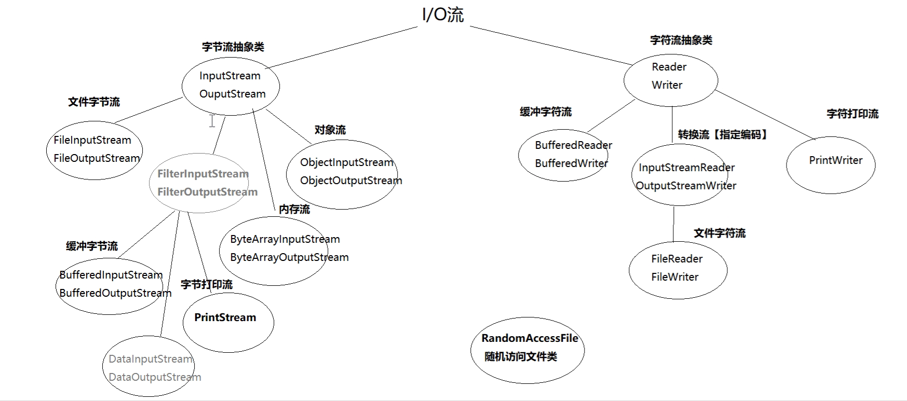

# day19

## I/O



### File类

概念：代表物理盘符中的一个文件或者文件夹【目录】。

方法：

- createNewFile()//创建一个新文件
- mkdir()//创建一个新目录
- delete()//删除文件或空目录 
- exists()//判断File对象所对象所代表的对象是否存在
- getAbsolutePath()//获取文件的绝对路径
- getName()//取得名字 
- getPath()//获取文件、目录所在的目录
- isDirectory()//是否是目录
- isFile()//是否是文件
- length()//获得文件的长度
- listFiles()//列出目录中的所有内容
- renameTo()//修改文件名

#### FileFileter接口

- public interface FileFilter
- boolean accept(File pathname)
- 当调用File类中的listFiles()方法时，支持传入FileFilter接口接口实现类，对获取文件进行过滤，只有满足条件的文件的才可出现在listFiles()的返回值中

#### FileInputStream

public int read(byte[] b) //从流中读取多个字节，将读到内容存入b数组，返回实际读到的字节数；如果达到文件的尾部，则返回-1

#### FileOutputStream(new  File,true) 

- true 不覆盖文件，追加操作
- public void write(byte[] b) //一次写多个字节，将b数组中所有字节，写入输出流


#### BufferedInputStream和BufferedOutputStream

```java
 public static void main(String[] args) throws IOException {
        BufferedInputStream bis = new BufferedInputStream(
                new FileInputStream("d:\\duo.jpg"));

        BufferedOutputStream bos = new BufferedOutputStream(
                new FileOutputStream("d:\\111.jpg"));
        int data;
        while ((data = bis.read()) != -1){// bis.read()返回int类型的实际读到的字节数
            bos.write(data);
        }
        bos.flush();//刷新缓存区，把剩下的数据从缓存区加入到文件
        bis.close();
        bos.close();//自动刷新缓存区，加入数据
    }
```

### 对象流

对象流：ObjectOutputStream/ObjectInputStream

增强了缓冲区功能

增强了读写8种基本数据类型和字符串功能

增强了读写对象的功能

- readObject() 从流中读取一个对象
- writeObject(Object obj) 向流中写入一个对象

使用对象流传输对象的过程称为序列化和反序列化

#### 对象序列化和反序列化

- 序列化

  ​	把对象写入到硬盘或网络中的过程。

- 反序列化

  ​	把硬盘或网络的二进制文件读取到内存形成对象的过程。

- 对象序列化的细节

  1. 序列化类及其对象属性必须实现Serializable接口
  2. transient修饰为临时属性不参与序列化，static属性不参与序列化
  3. 使用serialVersionUID属性保证序列化的类和反序列化的类是同一个类

  ```java
  public class TestObjectOutputAndInputStream {
      public static void main(String[] args) throws IOException, ClassNotFoundException {
          Student s1 = new Student("张三", 20);
  
          ObjectOutputStream oos = new ObjectOutputStream(
                  new FileOutputStream("d:\\stu.bin"));
          ObjectInputStream ois = new ObjectInputStream(
                  new FileInputStream("d:\\stu.bin"));
          //序列化
          oos.writeObject(s1);
          //Student.count = 2000;
          System.out.println("序列化完成...");
          oos.close();
  
          //反序列化
          Student s = (Student) ois.readObject();
          System.out.println(s.toString());
          //System.out.println(Student.count);
  
          ois.close();
  
      }
      static class Student implements Serializable{
          private String name;
          private transient int age;
          private static int count = 1000;
  
          private static final long serialVersionUID= 520;
          public String getName() {
              return name;
          }
  
          public void setName(String name) {
              this.name = name;
          }
  
          public int getAge() {
              return age;
          }
  
          public void setAge(int age) {
              this.age = age;
          }
  
          public Student() {
          }
  
          public Student(String name, int age) {
              this.name = name;
              this.age = age;
          }
  
          @Override
          public String toString() {
              return "Student{" +
                      "name='" + name + '\'' +
                      ", age=" + age +
                      '}';
          }
      }
  }
  ```

  

### 内存流

内存流：ByteArrayInputStream / ByteArrayOutputStream

操作的数据来自内存

```java
public class TestByteArrayInputStream {
    public static void main(String[] args) throws IOException {
        byte[] data = "helloworld".getBytes();
        ByteArrayInputStream bais = new ByteArrayInputStream(data);

        int d;
        while((d = bais.read()) != -1){
            System.out.print((char)d);
        }
        bais.close();
    }
}

public class TestByteArrayOutputStream {
    public static void main(String[] args) throws IOException {
        ByteArrayOutputStream baos = new ByteArrayOutputStream();

        for (int i = 0; i < 10; i++) {
            baos.write("helloworld".getBytes());
        }

        baos.close();

        System.out.println(baos.toString());
    }
}
```

### 字符流

#### 字符编码

ISO-8859-1：收录除ASCII外，还包括西欧、希腊语、泰语、阿拉伯语、希伯来语对应的文字符号。1个字节

UTF-8：针对Unicode的可变长度字符编码。1、2、3个字节

GB2312：简体中文。1、2个字节

GBK ：简体中文、扩充。 1、2个字节

GB18030：简体中文对GBK的扩展 。1、2个字节

BIG5：台湾，繁体中文 。1、2个字节

#### 字符流方法

字符流的父类(抽象类)

- Reader：字符输入流

  ​	public int read(char[] b,int off,int len){}

- Writer：字符输出流

  ​	public void write(int n){}

#### 文件字符流

- FileReader：

  ​	public int read(char[] c) //从流中读取多个字符，将读到内容存入c数组，返回实际读到的字符数；如果达到文件的尾部，则返回-1。

- FileWriter：

  ​	public void write(String str) //一次写多个字符，将b数组中所有字符，写入输出流。

注意：字符流只能操作文本文件，不能操作其他格式的文件，其他文件只能使用字节流

```java
public class TestFileReader {
    public static void main(String[] args) throws IOException {
        FileReader fr = new FileReader("d:\\111.txt");

        char[] buf = new char[1024*4];
        int len = 0;
        while((len = fr.read(buf)) != -1){
            System.out.println(new String(buf,0,len));
        }
        fr.close();
    }
}

public class TestFileWriter {
    public static void main(String[] args) throws IOException {
        FileWriter fw = new FileWriter("d:\\111.txt",true);//true追加操作

        fw.write("nqr",0,2);
        fw.flush();
        fw.close();
    }
}
```

#### 转换流

- 转换流：InputStreamReader/OutputStreamWriter

- 可将字节流转换为字符流

- 可设置字符的编码方式

  ```java
  public class TestOutputStreamReader {
      public static void main(String[] args) throws Exception {
          OutputStreamWriter osw = new OutputStreamWriter(new FileOutputStream("d:\\osw.txt"), "gbk");
  
          osw.write("java is best");
  
          osw.flush();
          osw.close();
      }
  }
  
  
  public class TestOutputStreamWriter {
      public static void main(String[] args) throws Exception {
          OutputStreamWriter osw = new OutputStreamWriter(new FileOutputStream("d:\\osw.txt"), "gbk");
  
          osw.write("java is best");
  
          osw.flush();
          osw.close();
      }
  }
  ```

#### 字符缓冲流

- 缓冲流：BufferedWriter/BufferedReader
- 自定义缓冲区大小
- 新增功能：可一次读一行，并支持输出换行符。

### 打印流

- PrintStream|PrintWriter：数据原样打印

  - 封装了print() / println()方法，支持写入后换行

  - 按照数据原样打印

    ```java
    public class TestPrintStream {
        public static void main(String[] args) throws Exception{
            PrintStream ps = new PrintStream("d:\\333.txt");
            PrintWriter pw = new PrintWriter("d:\\333.txt");
    
            ps.println(97);
            ps.println(true);
            ps.println('a');
            ps.println("asdasd");
    
            ps.close();
    //
    //        pw.println("wo");
    //
    //        pw.close();
        }
    }
    ```

- System.out 

  - PrintStream类型

  - 默认打印到控制台

  - 重定向标准输出流//System.setOut(new PrintStream("d:\\3333.txt"));

    ```java
    public class TestSystem {
        public static void main(String[] args) throws Exception{
            System.out.println("helloworld1");
            //重定向
            System.setOut(new PrintStream("d:\\3333.txt"));
            System.out.println("helloworld2");
        }
    }
    ```

- System.in

  ​	InputStream类型//字节流

  ```java
  public class TestSystemIn {
      public static void main(String[] args) throws Exception{
          //读取一个字节
  //        int d = System.in.read();
  //        System.out.println(d);
          //读取一个字符
  //        InputStreamReader isr = new InputStreamReader(System.in);
  //        int read = isr.read();
  //        System.out.println((char) read);
          //读取一行
          BufferedReader br = new BufferedReader(new InputStreamReader(System.in));
          String s = br.readLine();
          System.out.println(s);
      }
  }
  ```

  

### RandomAccessFile

即可以读取文件内容，也可以向文件中写入内容

但是和其他输入/输入流不同的是，程序可以直接跳到文件的任意位置来读写数据。

相当于DataInputStream和DataOutputStream两个类

读写模式

- r：只读
- rw：读写

作用

- 快速定位数据，支持并发读写
- 方便操作二进制文件

```java
public class TestRandomAccessFile {
    public static void main(String[] args) throws IOException {
        write();
       read();

    }
    public static void read() throws IOException {
        RandomAccessFile raf = new RandomAccessFile("d:\\111.txt","r");
        //跳过8个字节
        raf.skipBytes((8));
        //读文件
        String read = raf.readUTF();
        System.out.println(read.toString());
        raf.close();
    }
    public static void write() throws IOException {
        RandomAccessFile raf = new RandomAccessFile("d:\\111.txt","rw");

        raf.writeUTF("赵云");
        raf.writeUTF("刘备");

        raf.close();
    }
```


### Properties属性集合

特点

- 存储属性名和属性值
- 属性名和属性值都是字符串类型
- 没有泛型
- 和流有关（list、store、load）

属性文件

- 属性文件的后缀.properties
- 每行一个属性名和属性值，属性名和属性值中间使用=隔开
- 注意不能使用双引号、分号
- 中文需要使用unicode编码
- 注释使用#开头

```java
public class TestProperties {
    public static void main(String[] args) throws Exception{
        Properties properties = new Properties();
        properties.setProperty("name","张三");
        properties.setProperty("age","20");

        for (String s : properties.stringPropertyNames()) {
            System.out.println(s+"..."+properties.get(s));
        }

        //list()
        System.out.println("-----list();列表打印输出-------");
        properties.list(System.out);

        //store()
        FileOutputStream fos = new FileOutputStream("d:\\stu.properties");
        properties.store(fos, "注释内容");
        fos.close();

        //load()
        FileInputStream fis = new FileInputStream("d:\\stu.properties");
        Properties properties1 = new Properties();
        properties1.load(fis);

        fis.close();
        System.out.println("---------load()加载后读取---------");
        System.out.println(properties1);


        //补充
        Properties properties2 = System.getProperties();
        System.out.println("=========系统信息======");
        properties2.list(System.out);
    }
}
```


## 总结

#### File

代表物理盘符中的一个文件或者文件夹。

#### 流的概念

内存与存储设备之间传输数据的通道。

##### 流的分类

- 输入流、输出流
- 字节流、字符流
- 节点流、过滤流

##### 字节流

1. InputStream | OutputStream
2. FileInputStream | FileOutputStream
3. BufferedInputStream | BufferedOutputStream
4. ObjectInputStream | ObjectOutputStream
5. ByteArrayInputStream | ByteArrayOutputStream
6. PrintStream

#####  字符流

1. Reader | Writer
2. FileReader | FileWriter
3. BufferedReader | BufferedWriter
4. InputStreamReader | OutputStreamWriter
5. PrintWriter

RandomAccessFile类

Properties集合  list(); store(); load();  

## 网络编程

#### OSI（Open System Interconnection）开放式系统互联

1. 第七层: 应用层负责文件访问和管理、可靠运输服务、远程操作服务。(HTTP、FTP、SMTP)
2. 第六层: 表示层负责定义转换数据格式及加密，允许选择以二进制或ASCII格式传输
3. 第五层:会话层负责使应用建立和维持会话，使通信在失效时继续恢复通信。 (断点续传)
4. 第四层:传输层负责是否选择差错恢复协议、数据流重用、错误顺序重排。(TCP、UDP)
5. 第三层: 网络层负责定义了能够标识所有网络节点的逻辑地址。(IP地址)
6. 第二层: 链路层在物理层上，通过规程或协议(差错控制)来控制传输数据的正确性。 (MAC)
7. 第一层: 物理层为设备之间的数据通信提供传输信号和物理介质。 (双绞线、光纤)

#### 传输层协议：TCP/UDP

通信协议：计算机通信的语言【数据格式】

TCP协议：(Transmission Control Protocol) 传输控制协议

- 是一种面向连接的、可靠的、基于字节流的传输层通信协议；数据大小无限制

- 建立连接的过程需要三次握手，断开连接的过程需要四次挥手；效率低

  - 三次握手、四次挥手标志位

  - SYN：发起一个新连接。

  - FIN：释放一个连接。

  - ACK：确认序号有效。

UDP协议：(User Datagram Protocol) 用户数据报协议

- 是一种无连接的传输层协议，提供面向事务的简单不可靠信息传送服务，每个包的大小64KB；效率高。

#### 网络层协议：IP协议

- IP协议：Internet Protocol  互联网协议/网际协议

  ​	分配给互联网设备的数字标签（唯一标识），称为IP地址

- IP地址分为两种

  - IPV4：4字节32位整数，并分成4段8位的二进制数，每8位之间用圆点隔开，每8位可以转换为一个0~255的十进制整数
  - 格式：D.D.D.D 例如：255.255.255.255

- IPV6：16字节128位整数，并分成8段十六进制数，每16位之间用圆点隔开，每16位整数可以转换为一个0~65535的十进制数

  ​     格式：X.X.X.X.X.X.X.X 例如：FFFF.FFFF.FFFF.FFFF.FFFF.FFFF.FFFF.FFFF

#### IPv4的分类

A类：政府机构，1.0.0.1 ~ 126.255.255.254

B类：中型企业，128.0.0.1 ~ 191.255.255.254

C类：个人用户，192.0.0.1 ~ 223.255.255.254

D类：用于组播，224.0.0.1 ~ 239.255.255.254

E类：用于实验，240.0.0.1 ~ 255.255.255.254

回环地址：127.0.0.1，指本机，一般用于测试使用。

查看IP命令：ipconfig

测试网络命令：ping D.D.D.D

#### Port-端口号

端口号

- 在通信实体上进行网络通讯的程序的唯一标识；
- 一个端口号同时只能被一个程序使用，一个程序可以同时使用多个端口号；
- 端口号使用两个字节。

端口分类

- 公认端口：0~1023
- 注册端口：1024~49151
- 动态或私有端口：49152~65535

常用端口

- MySql：3306
- Tomcat：8080
- Web服务器：80、443
- FTP服务器：21
- SSH：22

CMD命令

- netstat -ano 查看端口号
- netstat -ano|findstr 进程ID或端口号

#### InetAddress类

概念

​	表示互联网协议（IP）地址对象，封装了与该IP地址相关的所有信息，并提供获取信息的常用方法。

方法

- public static InetAddress getLocalHost() 获得本地主机地址对象
- public static InetAddress getByName(String host) 根据主机名称获得地址对象
- public static InetAddress[] getAllByName(String host) 获得所有相关地址对象
- public String getHostAddress() 获取IP地址字符串
- public String getHostName() 获得IP地址主机名

#### 基于TCP的网络编程

基于TCP的Socket网络编程

- Socket【套接字】是操作系统提供的通信技术，网络中的一个通信节点
- TCP分为客户端【Socket】与服务器【ServerSocket】
- 通信基本要素：IP地址和端口号

##### TCP开发步骤

###### 服务器端

1. 创建服务器套接字，并指定端口号

2. 侦听，并返回客户端套接字

3. 获取输入流，输出流

4. 处理数据

5. 关闭资源

   ```java
   public class TcpServer {
       public static void main(String[] args) throws Exception{
   //        1. 创建服务器套接字，并指定端口号
           ServerSocket listener = new ServerSocket(8888);
   //        2. 侦听，并返回客户端套接字
           Socket socket = listener.accept();
   //        3. 获取输入流，输出流
           InputStream is = socket.getInputStream();
           BufferedReader br = new BufferedReader(
                   new InputStreamReader(is,"utf-8"));
   //        4. 处理数据
           String data = br.readLine();
           System.out.println("客户端说：" + data);
   //        5. 关闭资源
           br.close();
           socket.close();
           listener.close();
       }
   }
   ```

   

###### 客户端

1. 创建客户端套接字，并指定服务器的地址和端口号。

2. 获取输入流，输出流

3. 处理数据

4. 关闭资源

   ```java
   public class TcpClient {
       public static void main(String[] args) throws IOException {
   //        1. 创建客户端套接字，并指定服务器的地址和端口号。
           Socket socket  = new Socket("10.9.44.120",8888);
   //        2. 获取输入流，输出流
           OutputStream os = socket.getOutputStream();
           BufferedWriter bw = new BufferedWriter(new OutputStreamWriter(os,"utf-8"));
   //        3. 处理数据
           bw.write("好久不见！");
   //        4. 关闭资源
           bw.close();
           socket.close();
       }
   }
   ```

   