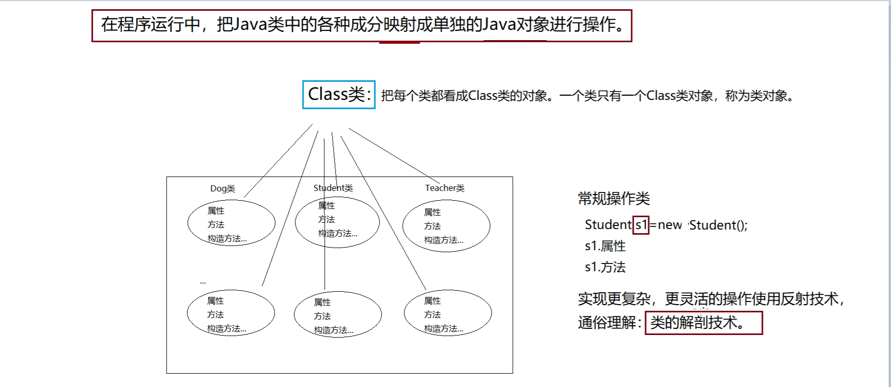

# day20

## TCP开发练习

### 实现聊天功能

服务器端

```java
public class ChatServer {
    public static void main(String[] args) {
        ExecutorService es = Executors.newCachedThreadPool();

        try(ServerSocket listener = new ServerSocket(6666)) {
            while(true){
                Socket socket = listener.accept();
                es.submit(new HandlerSocket(socket));
            }
        } catch (IOException e) {
            System.out.println("服务器关闭。。。");
            es.shutdown();
        }
    }
    static class HandlerSocket implements Runnable{
        private Socket socket;

        public HandlerSocket(Socket socket) {
            this.socket = socket;
        }

        @Override
        public void run() {
            if(socket != null){
                try(Socket s = socket;BufferedReader br = new BufferedReader(
                        new InputStreamReader(socket.getInputStream(),"utf-8"));) {
                    String line;
                    while((line = br.readLine()) != null){
                        System.out.println(s.getInetAddress()+"说"+line);
                    }
                    System.out.println(s.getInetAddress()+"客户端退出了。。。");
                } catch (IOException e) {
                    System.out.println(socket.getInetAddress()+"客户端非正常关闭。。。");
                }
            }
        }
    }
}
```

客户端

```java
public class ChatClient {
    public static void main(String[] args) {
        try( Socket socket = new Socket("10.9.44.174",6666);
             BufferedWriter bw = new BufferedWriter(
                     new OutputStreamWriter(socket.getOutputStream(),"utf-8"))) {
            Scanner sc = new Scanner(System.in);
            while (true){
                String data = sc.next();
                bw.write(data);
                bw.newLine();
                bw.flush();
                if(data.equals("886")){
                    break;
                }

            }
        } catch (Exception e) {
            System.out.println("客户端非正常关闭。。。");
        }
    }
}
```

### 实现注册功能

服务器端

```java
public class RegistServer {
    public static void main(String[] args) {
        ServerSocket listener=null;
        Socket socket=null;
        ObjectInputStream ois=null;
        BufferedWriter bw=null;
        try {
            //1创建ServerSocket对象
             listener=new ServerSocket(10086);
            //2开始侦听
            System.out.println("注册服务器已启动...");
            socket = listener.accept();
            //3获取输入流
//        InputStream is = socket.getInputStream();
             ois=new ObjectInputStream(socket.getInputStream());
             bw=new BufferedWriter(new OutputStreamWriter(socket.getOutputStream(),"utf-8"));
            //4处理
            User user=(User) ois.readObject();
            //4.1 读取硬盘中的所有用户信息
            List<User> list = readUser();
            boolean flag=false;
            if (list != null) {
                for (User u : list) {
                    if(u.getName().equals(user.getName())){
                        flag=true;//存在
                        break;
                    }
                }
            }else{
                list=new ArrayList<>();//初始化集合
            }
            if(!flag){
                list.add(user);
                //4.2把用户信息写入硬盘
                writeUser(list);
                //回复注册成功
                bw.write("注册成功");

            }else{
                bw.write("用户名已存在");
            }
            bw.newLine();
            bw.flush();
        } catch (Exception e) {
            e.printStackTrace();
        }finally {
            try {
                bw.close();
                ois.close();
                socket.close();
                listener.close();
            } catch (IOException e) {
                e.printStackTrace();
            }
        }
    }
    //读取硬盘中的所有用户信息
    public static List<User> readUser(){
        File file=new File("d:\\users.bin");
        List<User> list=null;
        if(file.exists()) {
            try(ObjectInputStream ois=new ObjectInputStream(new FileInputStream(file))) {
                list=(List<User>)ois.readObject();
                for (User user : list) {
                    System.out.println("================已经注册用户列表================");
                    System.out.println(user);
                }
            } catch (Exception e) {
            }
        }
        return list;
    }
    //把用户信息写入硬盘
    public static void writeUser(List<User> list){
        try (ObjectOutputStream  oos=new ObjectOutputStream(new FileOutputStream("d:\\users.bin",true))){
            oos.writeObject(list);
        } catch (Exception e) {
            throw new RuntimeException(e);
        }
    }
}
```

客户端

```java
public class RegistClient {
    public static void main(String[] args) {
        Socket socket=null;
        ObjectOutputStream oos=null;
        BufferedReader br=null;
        try {
            //1创建Socket对象，并指定服务器的地址和端口号
            socket=new Socket("10.9.44.199",10086);
            //2获取输出流、输入流
            //OutputStream os = socket.getOutputStream();
            oos=new ObjectOutputStream(socket.getOutputStream());
            br=new BufferedReader(new InputStreamReader(socket.getInputStream(),"utf-8"));
            //3处理
            //3.1 发送对象
            User user=new User(1,"zhangsan1","123456",20,99);

            oos.writeObject(user);
            oos.flush();
            //3.2读取回复
            String replay = br.readLine();
            System.out.println("服务器回复:"+replay);
        } catch (IOException e) {
            e.printStackTrace();
        }finally {
            try {
                br.close();
                oos.close();
                socket.close();
            } catch (IOException e) {
               e.printStackTrace();
            }
        }
    }
}

```

## UDP开发练习

#### 广播聊天

接受端

```java
public class ChatReceiver {
    public static void main(String[] args){
        try(DatagramSocket ds = new DatagramSocket(6666)) {
            byte[] buf = new byte[1024*64];
            DatagramPacket dp = new DatagramPacket(buf, buf.length);
            System.out.println("聊天室已启动");
            while(true){
                ds.receive(dp);
                String s = new String(dp.getData(), 0, dp.getLength());;
                System.out.println(dp.getAddress().getHostAddress()+"的"+dp.getAddress().getHostName()+"说"+s);
            }
        } catch (Exception e) {
            throw new RuntimeException(e);
        }
    }
}
```

发送端

```java
public class ChatSender {
    public static void main(String[] args) {
        try( DatagramSocket ds = new DatagramSocket()) {
            Scanner sc = new Scanner(System.in);
            while(true){
                String data =sc.next();
                DatagramPacket dp = new DatagramPacket(
                        data.getBytes(),data.getBytes().length,
                        InetAddress.getByName("10.9.44.255"),6666);
                ds.send(dp);
                if(data.equals("886")) break;
            }
        } catch (IOException e) {
            throw new RuntimeException(e);
        }
    }
}
```

## 反射

### 什么是反射

在程序运行中，把Java类中的各种成分映射成单独的Java对象进行操作



### 核心类

- Class类—可获取类和类的成员信息【反射核心类】
- Field类—可访问类的属性
- Method类—可调用类的方法
- Constructor类—可调用类的构造方法

### 获取类对象

1. 通过类的实例，获取类对象

   Student s = new Student();

   Class c = s.getClass();

2. 通过类名获取类对象

   Class c = 类名.class;

3. 通过静态方法获取类对象（推荐：耦合性低，灵活）

   Class c=Class.forName(“包名.类名”);

#### 常用方法（c.）

- public String getName()
- public Package getPackage()
- public Class<? super T> getSuperclass()
- public Class<?>[] getInterfaces()
- public Field[] getFields()
- public Method[] getMethods()//获取所有的公开方法，包含继承的
- public Method[] getDeclaredMethods()//获取所有的方法，包含非公开的，不包括继承
- public Constructor<?>[] getConstructors()
- public T newInstance()

### Java中创建对象的四种方式

1. 使用new关键字

   ```java
   Student s1 = new Student();
   ```

2. 反射

   ```java
           //无参
           Constructor<?> constructor = class3.getConstructor();
           Student s2 = (Student) constructor.newInstance();
           System.out.println(s2.getName());
           //有参
           Constructor<?> constructor1 = class3.getConstructor(String.class,int.class);
           Student s3 = (Student) constructor1.newInstance("zhao",2);
           System.out.println(s3.getName());
   ```

3. 反序列化（不会调用构造方法）

   ```java
    //反序列化
           ObjectInputStream objectInputStream = new ObjectInputStream(new FileInputStream("d:\\stu.bin"));
           Student s5 = (Student) objectInputStream.readObject();
   ```

4. 克隆（不会调用构造方法）

   ```java
   //克隆
   Student s6 = (Student) s3.clone();
   //字符串的HashCode都已经从写需要使用  System.identityHashCode()方法
   
   //实现String类型数据的深度拷贝
       @Override
       protected Object clone() throws CloneNotSupportedException {
           Student s = (Student) super.clone();
           s.name = new String(s.name);
           return s;
       }
   
   //无参方法
   Method show1 = class1.getMethod("show");
   show1.invoke(s3);
   //有参方法
   Method show2 = class1.getMethod("show",String.class);
   show2.invoke(s3,"123");
   //静态方法
   Method method1 = class1.getMethod("method1");
   method1.invoke(null);
   //访问私有方法
   Method method2 = class1.getDeclaredMethod("method2");
   //让访问权限无效
   method2.setAccessible(true);
   method2.invoke(s3);
   ```

### 内省

```java
public class Test {
    public static void main(String[] args) throws Exception{
        //不使用反射
        Student s1 = new Student();
        s1.setName("赵云");
        s1.setAge(18);
        System.out.println(s1);

        //使用反射
        Class<?> class1 = Class.forName("week05.day01.reflex.Student");
        Student s2 = (Student) class1.newInstance();
        String p1 ="name";
        String p2 = "age";
        Method method1 = class1.getMethod("set"+Character.toUpperCase(p1.charAt(0))
                + p1.substring(1),class1.getDeclaredField(p1).getType());
        Method method2 = class1.getMethod("set"+Character.toUpperCase(p2.charAt(0))
                + p2.substring(1),class1.getDeclaredField(p2).getType());
        method1.setAccessible(true);
        method1.invoke(s2,"李白");
        method2.invoke(s2,18);
        System.out.println(s2);

        //使用内省:使用反射机制给属性赋值的一种方式
        //propertyDescripor:代表一个属性
        Student s3 = (Student) class1.newInstance();
        PropertyDescriptor pd1 = new PropertyDescriptor(p1,class1);
        PropertyDescriptor pd2 = new PropertyDescriptor(p2,class1);
//        Method writeMethod1 = pd1.getWriteMethod();
//        Method writeMethod2 = pd2.getWriteMethod();
        pd1.getWriteMethod().invoke(s3,"刘备");
        pd2.getWriteMethod().invoke(s3,18);
        System.out.println(s3);
        System.out.println("==============Introspector===============");
        //BeanInfo: 类的信息对象
        //内省的属性：指的是类中包含的getXxx,setXxx,isXxx,xxx就是内省的属性
        //获取对象信息
        BeanInfo beanInfo = Introspector.getBeanInfo(class1);
        //获取信息中的属性
        PropertyDescriptor[] propertyDescriptors = beanInfo.getPropertyDescriptors();
        //遍历信息中的属性
        for (PropertyDescriptor propertyDescriptor : propertyDescriptors) {
            System.out.println(propertyDescriptor.getName());
        }
    }
}
```

#### 内省注意事项：

1. 使用内省:是使用反射机制给属性赋值的一种方式
2. 内省的属性：指的是类中包含的getXxx,setXxx,isXxx,xxx就是内省的属性
3. 内省的工具类Introspector

