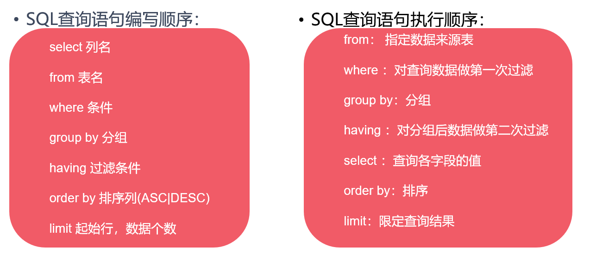

# day22

## MySql

### 通过cmd控制台连接数据库

- 输入mysql -uroot -p
- -h ip 默认连接本机

### MySQL命令基本语法

- MySQL每条命令或语句通常以;结尾，个别可以不用加分号，比如use、quit、exit
- MySQL语句不区分大小写。
- MySQL字符串、日期使用单引号或双引号包裹
- MySQL注释
  - 单行注释：#开头或者--空格开头 
  - 多行注释： /\*多行注释*/

### 基本命令

- 创建数据库：create database 数据库名;

  ```mysql
  create database GP_db1;
  ```

- 查看数据库创建信息：show create database 数据库名;

  ```mysql
  show create database GP_db1;
  ```

- 修改数据库编码：alter database 数据库名 character set 编码;

  ```mysql
  alter database GP_db1 character set utf8mb4;
  ```

- 删除数据库 ：drop databse 数据库名;

  ```mysql
  drop database GP_db1
  ```

- 查看当前所使用的的数据库：select database();

  ```mysql
  select database();
  ```

- 切换使用数据库：use 数据库名;

  ```mysql
  use GP_db1;
  ```

## SQL语言

### 概念

- SQL（Structured Query Language）结构化查询语言
- 用于存取数据、更新、查询和管理关系数据库系统的结构化查询语言
- 专门用来操作、管理数据库的一门语言

### 经验

- 通常执行对数据库的“增删改查”
- 简称C（Create）R（Read）U（Update）D（Delete）

### 分类

数据查询语言DQL（Data Query Language）

​	select、from、where、group by、having、order by、limit

数据定义语言DDL（Data Definition Language）

​	create、alter、drop

数据操作语言DML（Data Manipulation Language）

​	insert、update、delete

事务控制语言TCL（Transaction Control Language）

- begin、start transaction
- set autocommit=0
- commit
- rollback 

数据控制语言DCL（Data Control Language）

​	grant授权、revoke撤销权限

### 基本查询

- select 列名 from 表名;
- 给列起别名：列名 as '别名'
- 查询结果去重：distinct 列名

### 排序查询

select 列名 from 表名 order by 排序列 [排序规则];

| **排序规则** | **描述**                 |
| ------------ | ------------------------ |
| **asc**      | 对前面排序的列做升序排序 |
| desc         | 对前面排序的列做降序排序 |

依据单列排序

```mysql
select employee_id,salary  from t_employees order by salary DESC;
```

依据多列排序

```mysql
select employee_id,salary from t_employees order by salary desc ,employee_id ASC;
```

### 条件查询

- select 列名 from 表名 where 条件;

| **关键字** | **描述**                                               |
| ---------- | ------------------------------------------------------ |
| where      | 在查询结果中，筛选符合条件的查询结果，条件为布尔表达式 |

- 等值判断(=)，既可以判断，也可以赋值

```mysql
select employee_id,first_name,salary from t_employees where salary = 11000;
```

注意与java不同（==），mysql中等值判断使用=

- 逻辑判断(and、or、not)

```mysql
select employee_id,salary from t_employees where salary=11000 and commission_pct=0.30; 
```

- 不等值判断(> 、< 、>= 、<= 、!= 、<>)

```mysql
select employee_id,salary from t_employees where salary >= 6000 and salary <= 10000;
```

- 区间判断(between and)

```mysql
select employee_id,salary from t_employees where salary between 6000 and 10000; 
```

注意：在区间判断语法中，小值在前，大值在后，反之，得不到正确结果

- null 值判断

列名 is null ; 等于null

列名 is not null；不等于null

```mysql
select employee_id,salary,commission_pct from t_employees where commission_pct IS NULL; 
```

枚举条件判断 in(值1，值2，值3 ) 

```mysql
select employee_id,department_id  from t_employees where department_id IN(70,80,90);
```

注意：in的查询效率较低，可通过多条件拼接

- 模糊条件判断【like 关键字】
  1. 通配符：%， 任意长度的任意字符 
  2. 通配符：_，表示单个任意字符

查询名字为L开头任意长度的员工信息

```mysql
select employee_id,first_name,department_id from t_employees where first_name  like 'L%';
```

查询名字为L开头并且长度为4个字符的员工信息

```mysql
select employee_id,first_name,salary from t_employees where first_name like 'L_ _ _';
```

注意：模糊条件查询只能和like 关键字结合使用

### 分支结构查询

case 

  when 条件1 then 结果1

  when 条件2 then 结果2

  when 条件3 then 结果3

  else 结果4

end

```mysql
select employee_id,
       first_name,
       salary,
       case
           when salary >= 15000 then '高工资'
           when salary >= 10000 then '中工资'
           when salary >= 5000 then '一般工资'
           else '低工资'
           end as level
from t_employees;
```

通过使用case end进行条件判断，每条数据对应一个结果

执行流程

1. 如果条件1满足，则显示结果1。
2. 如果条件2满足，则显示结果2。
3. 如果条件3满足，则显示结果3。
4. 如果以上条件均不满足，显示结果4。

经验：类似Java中的多重选择结构

### 时间函数

语法：select 时间函数([参数列表]);

| **时间函数**          | **描述**                                 |
| --------------------- | ---------------------------------------- |
| sysdate()、now()      | 当前系统时间（日、月、年、时、分、秒）。 |
| curdate()             | 获取当前日期。                           |
| curtime()             | 获取当前时间。                           |
| week(date)            | 获取指定日期为一年中的第几周。           |
| year(date)            | 获取指定日期的年份。                     |
| hour(time)            | 获取指定时间的小时值。                   |
| minute(time)          | 获取时间的分钟值。                       |
| datediff(date1,date2) | 获取两个日期之间相隔的天数。             |
| adddate(date,n)       | 计算指定日期加上n天后的日期。            |

### 字符串函数

语法：select 字符串函数 ([参数列表]);

| **字符串函数**             | **描述**                                                     |
| -------------------------- | ------------------------------------------------------------ |
| concat(str1,str2,str....)  | 将多个字符串连接。                                           |
| insert(str,pos,len,newStr) | 将str中指定pos位置开始len长度的内容替换为newStr。  下标从1 开始 |
| lower(str)                 | 将指定字符串转换为小写。                                     |
| upper(str)                 | 将指定字符串转换为大写。                                     |
| substring(str,pos,len)     | 将str字符串指定pos位置开始截取len个内容。  下标从1开始       |
| length                     | 获取字符串的字节长度                                         |
| char_length                | 获取字符串字符长度                                           |

### 聚合函数

语法：select 聚合函数(列名) from 表名;

| **聚合函数** | **描述**                 |
| ------------ | ------------------------ |
| sum()        | 求所有行中单列结果的总和 |
| avg()        | 平均值                   |
| max()        | 最大值                   |
| min()        | 最小值                   |
| count()      | 总行数                   |

count(*)不写列名，不统计null

### 其他函数 

| **函数名称**  | **描述**              |
| ------------- | --------------------- |
| database()    | 获取当前选择的数据库  |
| ifnull(str,0) | 如果str为NULL,则返回0 |
| user()        | 返回当前用户          |
| version()     | 返回MySQL版本         |

### 分组查询

select 列名 from  表名 group by  分组依据（列）;

查询各部门总人数

```mysql
select department_id,count(employee_id) from t_employees group by department_id; 
```

查询各部门的平均工资

```mysql
select department_id,avg(salary)  from t_employees group by  department_id; 
```

注意

- 分组查询中，select显示的列只能是分组依据列，或者聚合函数列，不能出现其他列

### 分组过滤查询

select 列名 from 表名 group by 分组列 having 过滤规则;

统计平均工资大于等于10000的部门

```mysql
select department_id, avg(salary)  from t_employees group by department_id 
having avg(salary)>=10000;
```

注意

- having 是对分组之后的数据做过滤

### 限定查询

select 列名 from 表名 limit 起始行，查询行数;

查询表中前五行数据：

```mysql
select * from t_employees limit 0,5;
```

注意

- 起始行是从 0 开始，代表了第一行
- 第二个参数代表的是从指定行开始查询几行

### 基础查询总结

##### SQL查询语句编写顺序

select 列名 ——> from 表名 ——> where 条件 ——> group by 分组 ——> having 过滤条件 ——> order by【ASC|DESC】——> limit(起始行,数据)

##### SQL查询语句执行顺序

from 指定数据来源表 ——> where 对查询数据第一次过滤 ——> group by 分组 ——> having 对分组数据第二次过滤 ——> select 查询各个字段值

 ——> order by【ASC|DESC】排序 ——> limit(起始行,数据)限定查询结果




