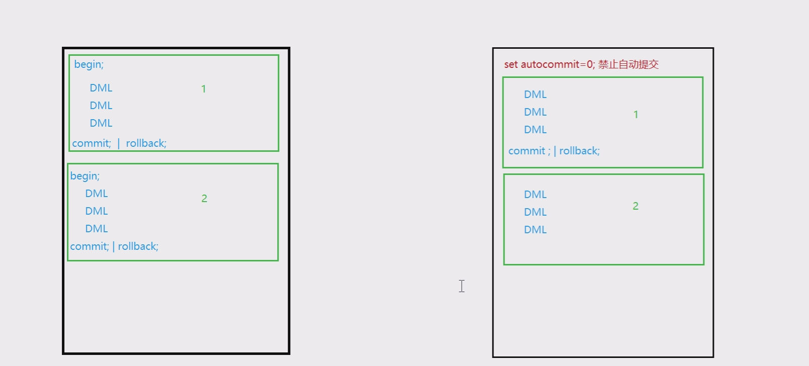

# day23

## MySQL

### SQL语句

> ### 子查询
>

概念：一个查询中嵌套一个查询，内层的查询称为子查询，外层查询称为父查询，执行时一般先执行子查询、再执行父查询。

#### 作为条件判断

select 列名 from 表名 WHERE 条件 (子查询结果);

查询工资大于Bruce的员工信息

先查询到Bruce的工资（一行一列）

```mysql
select salary from  t_employees where first_name= 'Bruce';
```

查询工资大于Bruce的员工信息

```mysql
select * from t_employees where salary > 6000;
```

将两条语句整合

```mysql
select * from t_employees where salary > 
（select salary from  t_employees where first_name = 'Bruce' ）;
```

注意：一行一列的结果才能作为父查询的等值判断条件或不等值条件判断

#### 作为枚举查询条件

select 列名 from  表名 where 列名 in(子查询结果);

当子查询结果集形式为多行单列时可以使用all或any关键字

```mysql
#查询高于 60 部门所有人的工资的员工信息（高于所有）：
select * from t_employees where salary > all
(select salary from  t_employees where department_id=60);
#查询高于 60 部门任意一个人的工资的员工信息（高于部分）：
select * from t_employees where salary > any
(select salary from t_employees where department_id=60);
```

#### 作为一张临时表

•select 列名 from （子查询的结果集）as 别名 where 条件;

> ### 合并查询

select * from 表名1 union select * from 表名2;

union 去重

union all 不去重

```mysql
select * from t1 union select * from t2;
select * from t1 union all  select  * from t2;
```

### 连接查询

#### 交叉连接

select 列名 from 表1 cross join 表2；SQL标准

select 列名 from 表1,表2; 传统写法

#### 内连接

select 列名 from 表1 连接方式 表2 on 连接条件;

```mysql
#查询员工的部门信息（不包括没有部门的员工） SQL标准
select * from  t_employees inner join t_jobs ON t_employees.JOB_ID =t_jobs.JOB_ID;
#查询员工的部门信息（不包括没有部门的员工） 传统写法
select * from t_employees,t_jobs where t_employees.JOB_ID = t_jobs.JOB_ID;
```

经验

- 第一种属于SQL标准，与其他关系型数据库通用。
- 在MySql中，第二种方式也可以作为内连接查询，但是不符合SQL标准

#### 外连接

- ##### 左外连接

  left outer join on

  ```mysql
  #查询所有员工信息，以及所对应的部门名称（没有部门的员工，也在查询结果中,部门名称以NULL 填充）
  select e.employee_id,e.first_name,e.salary,d.department_name from t_employees e left outer join  t_departments d 
  on e.department_id = d.department_id;
  ```

  左外连接，是以左表为主表，依次向右匹配

  匹配到，返回结果。匹配不到，则返回NULL值填充

- ##### 右外连接

  ```mysql
  #查询所有部门信息，以及此部门中的所有员工信息（没有员工的部门，也在查询结果中，员工信息以NULL 填充）
  select e.employee_id,e.first_name,e.salary,d.department_name from t_employees e right outer join  t_departments d 
  on e.department_id = d.department_id;
  ```

  右外连接，是以右表为主表，依次向左匹配

  匹配到，返回结果,匹配不到，则返回NULL值填充

### 数据操作(DML)

- #### 增

  insert into 表名(列1，列2，列3....) values (值1，值2，值3......);

  注意：表名后的列名和values里的值要一一对应（个数、顺序、类型）。

- #### 删

  delete from 表名 where 条件；

  注意：删除时，如若不加 where 条件，删除的是整张表的数据。

- #### 改

  update 表名 set 列1=新值1 ,列2 = 新值2, .... where 条件;

  注意：

  - set 后多个列名=值
  - 绝大多数情况下都要加where条件，指定修改，否则为整表更新

### 数据类型

#### 数值类型

| **类型**     | **大小** | **范围（有符号）**            | **范围（无符号）**               |
| ------------ | -------- | ----------------------------- | -------------------------------- |
| int          | 4字节    | (-2147483648，2147483647)     | (0，4294967295)                  |
| double       | 8字节    | （-1.797E+308,-2.22E-308）    | (0,2.22E-308,1.797E+308)         |
| double(M,D)  | 8字节    | DOUBLE(5,2)  ，-999.99-999.99 | M表示位数最大值65，D表示小数位数 |
| decimal(M,D) | 8字节    | DECIMAL(5,2) ，-999.99-999.99 | 同上                             |

#### 字符串类型

| **类型** | **大小**    | **用途**                                                     |
| -------- | ----------- | ------------------------------------------------------------ |
| char     | 0-255字符   | 定长字符串 char(10)10个字符。  优点：查询速度快；缺点：浪费空间 |
| varchar  | 0-65535字符 | 变长字符串 varchar(10)10个字符  优点：节省空间；缺点：查询速度慢 |
| blob     | 0-65535字节 | 存储二进制形式的文件数据                                     |
| text     | 0-65535字节 | 存储长文本文件数据                                           |

**MySQL中每条记录最大长度64K**

#### 日期时间类型

| **类型**     | **大小** | **范围**                                                     | **格式**             | **用途**                 |
| ------------ | -------- | ------------------------------------------------------------ | -------------------- | ------------------------ |
| date         | 3字节    | 1000-01-01/9999-12-31                                        | YYYY-MM-DD           | 日期值                   |
| time         | 3字节    | -838:59:59'/'838:59:59                                       | HH:MM:SS             | 时间值或持续时间         |
| year         | 1字节    | 1901/2155                                                    | YYYY                 | 年份值                   |
| **datetime** | 6字节    | 1000-01-01  00:00:00/9999-12-31 23:59:59                     | YYYY-MM-DD  HH:MM:SS | 混合日期和时间值         |
| timestamp    | 4字节    | 1970-01-01  00:00:00/2038   结束时间是  北京时间  2038-1-19 11:14:07  格林尼治时间  2038年1月19日 凌晨 03:14:07 | YYYYMMDD  HHMMSS     | 混合日期和时间值，时间戳 |

### 操作表(DDL)

alter table 表名 操作;

```mysql
#向表中添加列
alter table course add gradeId int;
#删除表中的列
alter table course drop gradeId int;
#修改列名和类型
alter table course change course_hours hours int;
#修改表编码
altert table course character set gbk;
#修改表名
alter table course rename  t_course;
#删除表
alter drop course;
```

> ### 约束

概念：用于限制加入表的数据的类型和规范

#### 实体完整性约束(约束行)

##### 主键约束

语法：primary key

作用：唯一标识表中的一行数据，此列的值不可重复，且不能为 NULL

为适用于主键的列添加主键约束

primary key(字段1,字段2)定义在数据之后

```mysql
create table if not exists course
(
    course_id    int primary key,
    course_name  varchar(20),
    course_hours int
) charset = gbk;

create table if not exists score
(
    stu_id    int,
    course_id int,
    result    double,
    exam_time datetime,
    primary key (stu_id, course_id)#联合约束
);
```

##### 唯一约束

唯一约束

语法：unique

唯一标识表中的一行数据，不可重复，可以为NULL

```mysql
create table if not exists student
(
    stu_id      int primary key,
    stu_name    varchar(30) unicode ,
    stu_age     int,
    stu_gender  char(2),
    stu_address varchar(200),
    regist_time datetime
);
```

##### 自动增长列（标识列）

语法：auto_increment。

不能单独使用，给主键或唯一键数值列添加自动增长，每个表只能有一个。

默认从1开始，每次加1；可以使用auto_increment=100修改初始值

为编号添加自动增长：

```mysql
create table if not exists course
(
    course_id    int primary key auto_increment,
    course_name  varchar(20),
    course_hours int
) auto_increment = 100;#从100开始自增
```

#### 域完整性约束(约束列)

1. 数据类型

   数值类型、字符串类型、日期时间类型

2. 非空约束

   语法 not null

   作用：非空

   ```mysql
   create table if not exists student
   (
       stu_id      int primary key,
       stu_name    varchar(30) unicode not null ,
       stu_age     int,
       stu_gender  char(2),
       stu_address varchar(200),
       regist_time datetime
   );
   ```

3. 默认值约束：

   语法：default 值

   作用：为列赋予默认值，新增数据不指定值或书写DEFAULT，使用默认值进行填充

   ```mysql
   create table if not exists student
   (
       stu_id      int primary key,
       stu_name    varchar(30) unicode not null ,
       stu_age     int,
       stu_gender  char(2),
       stu_address varchar(200) default '地址不详',
       regist_time datetime
   
   );
   
   insert into student
   values (1, '赵云', 20, '男', default, '2023-8-17 10:20:12');
   ```

#### 引用完整性约束(外键约束)

- 语法

  constraint [外键名] foreign key（列名） references 主表(列名)

- 作用

  foreign key 引用外部表的某个列的值

  新增数据时，约束此列的值必须是引用表中已经存在的值

- 注意

  当两张表存在引用关系，若要执行删除操作，一定要先删除从表（引用表），再删除主表（被引用表）

> ### 事务

#### 概念

事务是一个原子操作，由一个或多个SQL语句组成

在同一个事务当中，所有的SQL语句要么全部执行成功，要么全部失败

#### 原理

- 数据库会为每一个客户端都维护一个空间独立的缓存区(回滚段)
- 一个事务中所有的增删改语句的执行结果都会缓存在回滚段中
- 当事务中所有SQL语句均正常结束，才提交（commit），才会将回滚段中的数据同步到数据库
- 否则无论因为哪种原因失败，整个事务将回滚（rollback）

#### 事务的边界

开始：

- 默认连接到数据库，隐式开始事务，每条语句执行完自动提交或回滚
- 手动使用begin; 或 start transaction; 显示开启事务，不会自动提交或回滚
- set autocommit=0; #禁止自动提交

结束：

提交：

- 显式提交：commit;
- 隐式提交：一条DML语句，正常提交

回滚：

- 显式回滚：rollback;

- 隐式回滚：

  - 非正常退出（断电、宕机）

  - 执行了创建、删除的语句，但是失败了，会为这个无效的语句执行回滚

begin与set autocommit=0 的区别



#### 事务的特性

##### Atomicity【原子性】

表示一个事务内的所有操作是一个整体，要么全部成功，要么全部失败

##### Consistency【一致性】

事务执行前，和事务执行后数据保持一致性

表示一个事务内有一个操作失败时，所有的更改过的数据都必须回滚到修改前状态

##### Isolation【隔离性】

两个或多个事务同时操作一个数据，一个事务对另一个事务的影响程度

一个事务看到的要么是另一并发事务修改它之前的状态；要么是另一事务修改它之后的状态，事务不会查看中间状态的数据

##### Durability【持久性】

持久性事务完成之后，它对于系统的影响是永久性的

#### 事务隔离级别

##### 查看修改事务隔离级别

- select @@tx_isolation; #查看隔离级别
- set session transaction isolation level [隔离级别] #修改隔离级别

##### MySQL支持四种隔离级别

###### Read Uncommitted（读取未提交内容)

在该隔离级别，所有事务都可以看到其他未提交事务的执行结果。本隔离级别很少用于实际应用，因为它的性能也不比其他级别好多少。读取未提交的数据，称之为脏读（Dirty Read）。

###### Read Committed（读取提交内容）

大多数数据库系统的默认隔离级别（但不是MySQL默认的）。它满足了隔离的简单定义：一个事务只能看见已经提交事务所做的改变。这种隔离级别出现不可重复读（Nonrepeatable Read）问题，因为同一事务的其他实例在该实例处理期间可能会有新的commit，所以同一select可能返回不同结果。

###### Repeatable Read （可重复读）

这是MySQL的默认事务隔离级别，它确保同一事务的多个实例在并发读取数据时，会看到同样的数据行。不过理论上，这会导致另一个棘手的问题：幻读（Phantom Read）。简单的说，幻读指当用户读取某一范围的数据行时，另一个事务又在该范围内插入了新行，当用户再读取该范围的数据行时，会发现有新的“幻读” 行。InnoDB和Falcon存储引擎通过多版本并发控制机制解决了该问题。

###### Serializable（串读）

最高的隔离级别，它通过强制事务排序，使之不可能相互冲突，从而解决幻读问题。简言之，它是在每个读的数据行上加上共享锁。在这个级别，可能导致大量的超时现象和锁竞争。效率最低的。