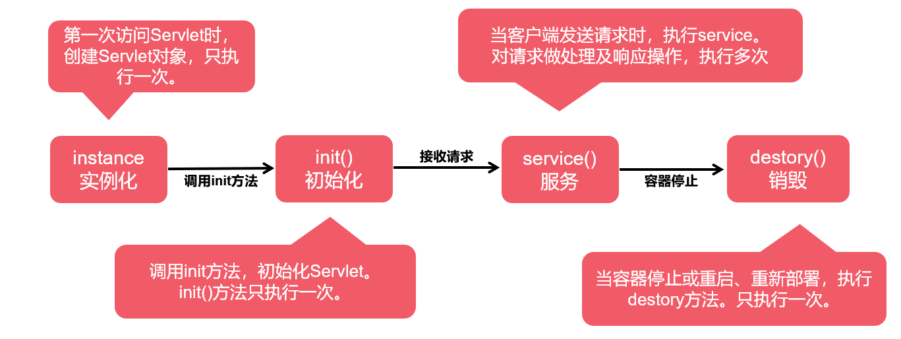

# day30

## servlet生命周期

从创建到销毁的整个过程



## Servlet线程安全问题

### 线程安全问题

- Servlet在访问之后，会创建一个Servlet对象
- Tomcat容器可以同时多个线程并发访问同一个Servlet
- 如果在方法中对成员变量做修改操作，就会有线程安全的问题

### 何保证线程安全？

- synchronized或Lock
- 尽可能使用局部变量

## request对象

获取表单数据

| **方法名**                                 | **说明**                         |
| ------------------------------------------ | -------------------------------- |
| String  getParameter(String name)          | 根据表单组件名称获取提交数据     |
| String[]  getParameterValues(String name)  | 根据表单组件名称获取提交数组数据 |
| void  setCharacterEncoding(String charset) | 指定每个请求的编码               |

### •GET请求：

- GET提交的数据会放在URL之后，以?分割URL和传输数据，参数之间以&相连

  ```java
  response.sendRedirect("index.jsp?gift="+ URLEncoder.encode("香烟美酒","utf-8") +"&money=100000");//重定向传递数据只能通过url传递
  
  ```

- GET方式明文传递，数据量小，不安全

- 效率高，浏览器默认请求方式为GET请求

- 对应的Servlet的方法是doGet

### POST请求

- POST方法是把提交的数据放在HTTP请求报文的Body中
- 数据量大，相对安全
- 效率相对没有GET高
- 对应的Servlet的方法是doPost

#### Post请求乱码

##### Post请求收参产生乱码

- 客户端以浏览器设置的编码将表单数据传输到服务器端
- 服务器默认是以ISO-8859-1编码接收

##### 解决方案

使用request的setCharacterEncoding(charset)方法进行统一的编码设置

## response对象

| **方法名**                   | **说明**                             |
| ---------------------------- | ------------------------------------ |
| getOutputStream()            | 获取字节输出流，和字符流不能同时使用 |
| getWriter()                  | 获取字符输出流                       |
| setCharacterEncoding(String) | 设置服务端响应内容编码格式           |
| setContentType(String)       | 设置响应文件类型、响应式的编码格式   |
| setHeader(name,value)        | 设置响应信息头                       |

### 解决中文乱码

#### 方案1

- 设置服务器端响应的编码格式。
- 设置客户端响应内容的头内容的文件类型及编码格式。
- response.setCharacterEncoding("UTF-8");
- 添加meta标签\<meta charset="utf-8">

#### 方案2【推荐】

- 同时设置服务端的编码格式和客户端响应的文件类型及响应时的编码格式。
- response.setContentType("text/html;charset=UTF-8");
- response.setHeader("Content-Type","text/html;charset=UTF-8");

## 跳转方式

### 转发

概念

- 转发发生在服务器端
- 将请求发送给服务器上的其他资源，以共同完成一次请求的处理

```java
request.getRequestDispatcher("/目标URL-pattern").forward(request, response);
```

注意

使用forward跳转时，是在服务器内部跳转，地址栏不发生变化，属于同一次请求

#### 数据传递

forward表示一次请求。

是在服务器内部跳转，可以共享同一次request作用域中的数据。

#### request作为域【容器】对象

拥有存储数据的空间，作用范围是一次请求有效。

1. 存储数据

   request.setAttribute(key,value);

2. 获取数据

   request.getAttribute(key);

3. 删除数据

   request.removeAttribute(key);

### 重定向

概念：

- 重定向作用在客户端
- 客户端请求服务器，服务器响应给客户端一个新的请求地址，客户端重新发送新请求

实现

```java
response.sendRedirect("目标URL");
```

URL：用来表示服务器中定位一个资源，资源可以是当前项目的地址，也可以别的网站地址

注意：使用redirect跳转时，是在客户端跳转，地址栏发生变化，属于多次请求

### 区别

#### 转发特点

- 转发是服务器行为
- 浏览器只做了一次访问请求
- 转发浏览器地址不变
- 转发两次跳转之间传输的信息不会丢失，所以可以通过request进行数据的传递
- 转发只能将请求转发给同一个Web应用中的其他组件

#### 重定向特点

- 重定向是客户端行为
- 浏览器做了至少两次的访问请求
- 浏览器地址改变
- 两次跳转之间传输的信息会丢失
- 可以指向任何的资源：包括当前应用程序中的其他资源、同一个站点上的其他应用程序中的资源、其他站点的资源