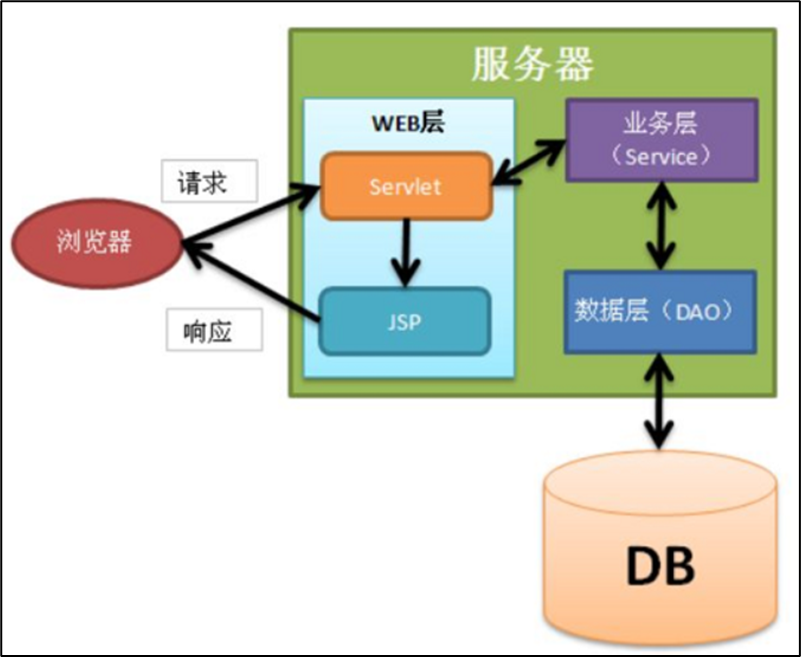

# day33

## MVC模式

| 名称                 | 功能描述                                                     |
| -------------------- | ------------------------------------------------------------ |
| 模型（Model）        | 业务模型service、数据模型dao、实体类、工具类等               |
| 视图（View）         | 视图即是用户看到并与之交互的界面，比如HTML、JSP等等          |
| 控制器（Controller） | 控制器即是控制请求的处理逻辑，对请求进行处理，负责转发、重定向 |

### MVC和三层的对应关系

- Web层对应MVC中的Controller(Servlet)和View(JSP、Html)

- 其他层都属于MVC中的Model

  